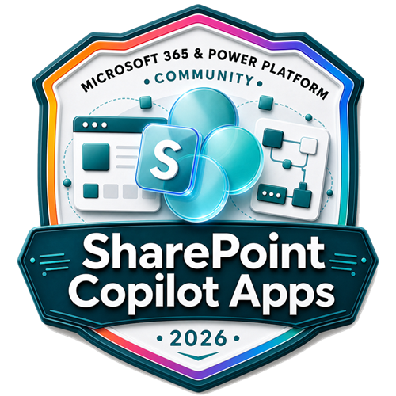

# SharePoint Copilot Apps Samples - UX in Copilot canvas

This repository contains Microsoft and community provided samples that demonstrate how to build, extend, and customize **Copilot experiences for Microsoft 365 Copilot**. The goal is to provide a curated, open collection of reusable samples that help you get started faster when building Sharepoint Copilot Apps which provide you an option to expose UX components directly in the Microsoft 365 Copilot canvas.

See more details from the announcement blog post at [Going beyond text in Microsoft 365 Copilot – Introducing SharePoint Copilot Apps](https://devblogs.microsoft.com/microsoft365dev/going-beyond-text-in-microsoft-365-copilot-introducing-sharepoint-copilot-apps/).

> [!NOTE]
> This repository is a community effort, maintained together with the [Microsoft 365 & Power Platform Community](https://aka.ms/community/home). Samples are provided _as is_ and are not officially supported products. See [SUPPORT.md](./SUPPORT.md) for details.


## What you'll find here

Each sample lives in its own self-contained folder under the [`samples`](./samples) directory and includes:

- A clear `README.md` describing what the sample does and how to run it.
- The complete source code required to build and deploy the sample.
- A mandatory `assets` folder containing a `sample.json` metadata file (used to surface the sample in community sample browsers) and a `preview.png` screenshot. Additional screenshots or recordings can also be placed here.

## Using the samples

To build and run these samples, you'll need to clone the repository and work within an individual sample folder.

Clone this repository:

```bash
git clone https://github.com/pnp/spfx-copilot-apps.git
```

Navigate into the cloned repository:

```bash
cd spfx-copilot-apps
```

Move into the sample you want to use, replacing `sample-folder-name` with the name of the sample:

```bash
cd samples
cd sample-folder-name
```

Each sample folder contains its own `README.md` with the exact prerequisites, build steps, and deployment instructions for that specific sample. Always follow the instructions in the sample's own `README.md`, as requirements may differ between samples.

## Contributing

These samples come directly from Microsoft and the broader community. We welcome your contributions, issue reports, and suggestions for new samples.

Before submitting a pull request, please review the [Contribution Guidance](./CONTRIBUTING.md) so we can process your contribution as quickly as possible. You can use the assets in the [`templates`](./templates) folder as a starting point for your own sample.

All contributors on this repository will be acknowledged with special SharePoint Skills Credly badge.



## Have issues or questions?

Please use the following logic when submitting questions or issues so they reach the right place:

- For a general question or challenge with SharePoint Copilot Apps or the SharePoint Framework, use the [sp-dev-docs repository issue list](https://github.com/SharePoint/sp-dev-docs/issues).
- For an issue with a specific sample in this repository, use the [issue list in this repository](https://github.com/pnp/spfx-copilot-apps/issues).

## Additional resources

- [Going beyond text in Microsoft 365 Copilot – Introducing SharePoint Copilot Apps](https://devblogs.microsoft.com/microsoft365dev/going-beyond-text-in-microsoft-365-copilot-introducing-sharepoint-copilot-apps/)
- [Build agents for Microsoft 365 Copilot](https://learn.microsoft.com/microsoft-365-copilot/extensibility/)
- [Overview of the SharePoint Framework](https://learn.microsoft.com/sharepoint/dev/spfx/sharepoint-framework-overview)
- [SharePoint Framework development tools and libraries](https://learn.microsoft.com/sharepoint/dev/spfx/tools-and-libraries)
- [Set up your Microsoft 365 development environment](https://learn.microsoft.com/sharepoint/dev/spfx/set-up-your-developer-tenant)

## Code of Conduct

This repository has adopted the [Microsoft Open Source Code of Conduct](https://opensource.microsoft.com/codeofconduct/). For more information see the [Code of Conduct FAQ](https://opensource.microsoft.com/codeofconduct/faq/) or contact [opencode@microsoft.com](mailto:opencode@microsoft.com) with any additional questions or comments.

## Disclaimer

**THIS CODE IS PROVIDED _AS IS_ WITHOUT WARRANTY OF ANY KIND, EITHER EXPRESS OR IMPLIED, INCLUDING ANY IMPLIED WARRANTIES OF FITNESS FOR A PARTICULAR PURPOSE, MERCHANTABILITY, OR NON-INFRINGEMENT.**

> Sharing is caring!
