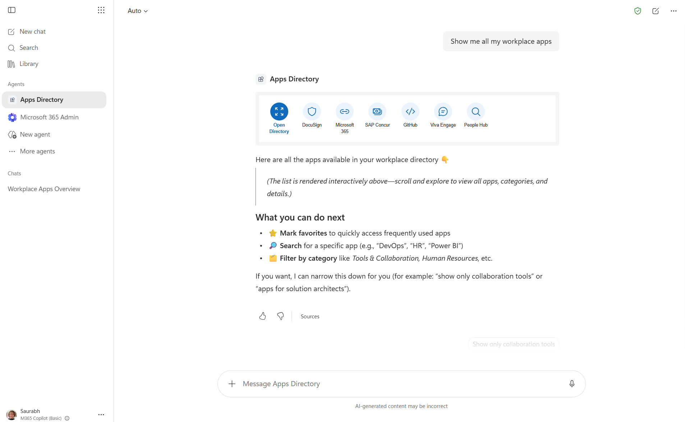
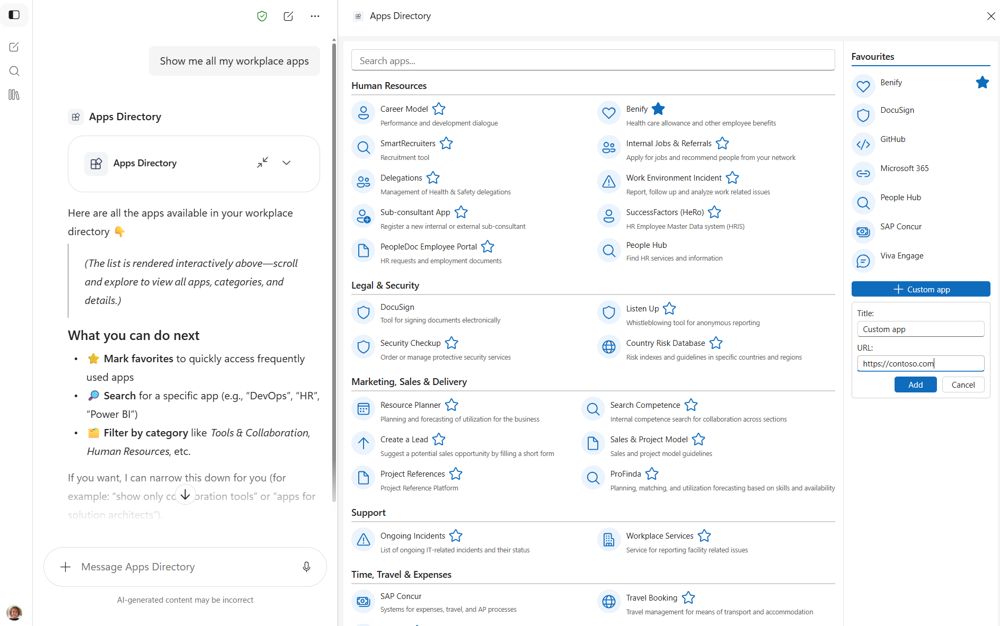
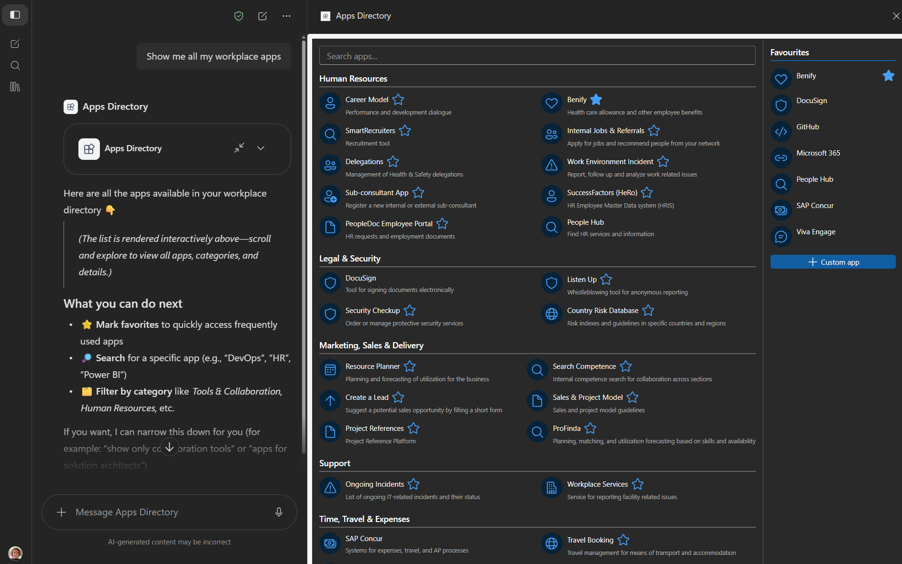

# Apps directory - Workplace Application Catalogue

    

## Summary

**Apps directory** is a **SharePoint Copilot App** built as an SPFx 1.24 **Copilot Component** (not a classic web part). It brings your organisation's full application catalogue into Microsoft 365 Copilot. Browse apps by category, search by name or keyword, mark your most-used apps as favourites for quick access, and launch any app directly from the Copilot chat. You can also add custom app shortcuts and filter the directory to show only your personal favourites.

The same React component renders in two modes inside the Copilot canvas:

- a compact **inline** tile grid showing your pinned favourites, and
- an immersive **full-screen** view with a **categories panel** and a **favourites panel** side by side.

Favourites and custom apps are **persisted to the user's OneDrive** (via Microsoft Graph) so the personalisation roams across devices and sessions.

The sample ships with **mocked data** so anyone can deploy and demo in minutes. The mock app list is served through a swappable `getMockApps()` function, ready to be replaced by a live SharePoint list or Microsoft Graph data source without touching the UI.

### Inline



### Full screen



### Dark mode



## Applies to

- [SharePoint Framework](https://aka.ms/spfx) 1.24+ (Copilot Component)
- [Microsoft 365 Copilot](https://www.microsoft.com/microsoft-365/copilot)
- [Microsoft 365 tenant](https://docs.microsoft.com/sharepoint/dev/spfx/set-up-your-developer-tenant) with the SharePoint App Catalog

> Get your own free development tenant by subscribing to [Microsoft 365 developer program](http://aka.ms/o365devprogram)

## Solution

| Solution | Author(s) |
| -------- | --------- |
| apps-directory | [Saurabh Tripathi](https://github.com/saurabh7019) |

## Version history

| Version | Date          | Comments        |
| ------- | ------------- | --------------- |
| 1.0     | July 16, 2026 | Initial release |

## Prerequisites

- Node.js >=22.14.0 <23.0.0
- A Microsoft 365 tenant with SPFx 1.24 (dev preview) enabled
- SharePoint App Catalog site
- [Heft](https://heft.rushstack.io/) (`npm install -g @rushstack/heft`)
- A tenant admin to approve the **Microsoft Graph `Files.ReadWrite`** permission after deployment (required for OneDrive persistence of favourites)

## Minimal Path to Awesome

- Clone this repository
- Ensure that you are at the solution folder (`samples/apps-directory`)
- in the command-line run:
  - `npm install -g @rushstack/heft`
  - `npm install`
  - `heft start`

Production build, test, and package:

```bash
heft test --clean --production && heft package-solution --production
```

Other build commands can be listed using `heft --help`.

## Features

- An SPFx **Copilot Component** (`copilotType: "Ux"`) that renders inside the Microsoft 365 Copilot canvas
- Handles **inline and full-screen display modes** in a single React component
- Persists user data (favourites, custom apps) to **OneDrive via Microsoft Graph**
- Passes agent tool inputs (`category`, `searchQuery`, `showFavoritesOnly`) to filter the UI from a natural-language prompt
- Ships with **mocked data** for easy testing and demos; ready to swap for a live **SharePoint list** without touching the UI

## References

- [Getting started with SharePoint Framework](https://docs.microsoft.com/sharepoint/dev/spfx/set-up-your-developer-tenant)
- [Building for Microsoft teams](https://docs.microsoft.com/sharepoint/dev/spfx/build-for-teams-overview)
- [Use Microsoft Graph in your solution](https://docs.microsoft.com/sharepoint/dev/spfx/web-parts/get-started/using-microsoft-graph-apis)
- [Publish SharePoint Framework applications to the Marketplace](https://docs.microsoft.com/sharepoint/dev/spfx/publish-to-marketplace-overview)
- [Microsoft 365 Patterns and Practices](https://aka.ms/m365pnp) - Guidance, tooling, samples and open-source controls for your Microsoft 365 development
- [Heft Documentation](https://heft.rushstack.io/)

## Help

We do not support samples, but this community is always willing to help, and we want to improve these samples. We use GitHub to track issues, which makes it easy for community members to volunteer their time and help resolve issues.

You can try looking at [issues related to this sample](https://github.com/pnp/spfx-copilot-apps/issues) to see if anybody else is having the same issues.

If you encounter any issues using this sample, [create a new issue](https://github.com/pnp/spfx-copilot-apps/issues/new).

## Disclaimer

**THIS CODE IS PROVIDED _AS IS_ WITHOUT WARRANTY OF ANY KIND, EITHER EXPRESS OR IMPLIED, INCLUDING ANY IMPLIED WARRANTIES OF FITNESS FOR A PARTICULAR PURPOSE, MERCHANTABILITY, OR NON-INFRINGEMENT.**