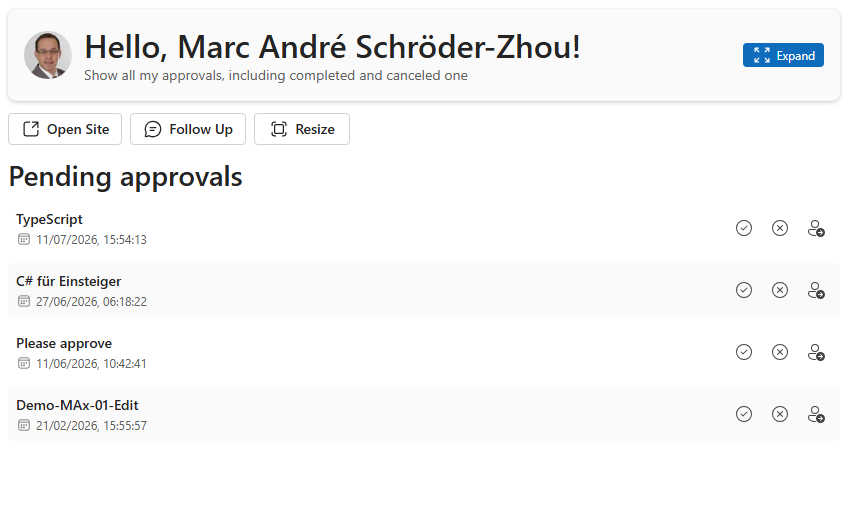
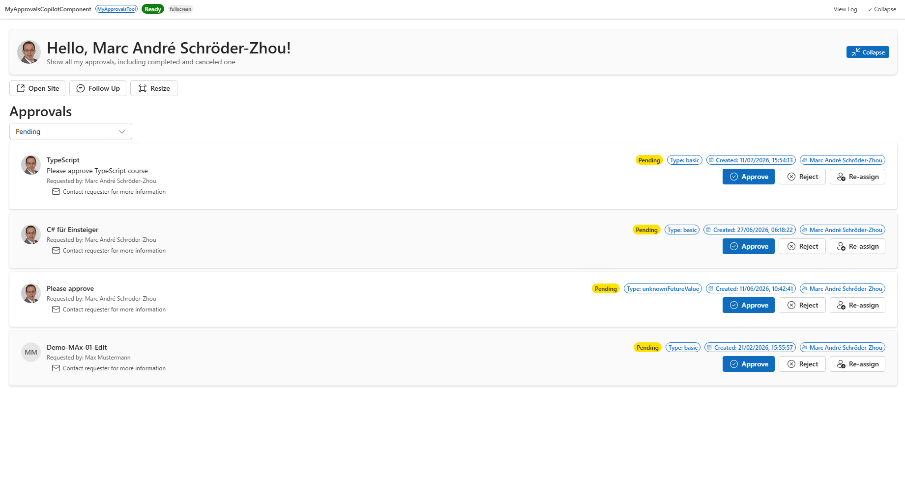

# MyApprovals - Microsoft 365 Approval Requests in Copilot Chat

## Summary

**MyApprovals** is an SPFx **Copilot Component** that brings the signed-in user's Microsoft 365 approval requests — the same ones surfaced by the Teams/Outlook **Approvals** app — directly into the Microsoft 365 Copilot canvas. A declarative agent ("MyApprovals Agent") calls it as a tool, and it renders a live, interactive list of approvals inline in the conversation or as a fullscreen overview, reading and writing real data through the Microsoft Graph Approvals API.

From the rendered UI, the signed-in user can:

- See who requested each approval (with their photo and name), its status, type, creation date, and description
- Filter approvals by status (pending, completed, canceled, created) in fullscreen mode
- Approve, reject, or re-assign a pending approval
- Email the requester directly for more information





## Compatibility


## Applies to

- [SharePoint Framework](https://learn.microsoft.com/sharepoint/dev/spfx/sharepoint-framework-overview) 1.24+ (Copilot Component)
- [Microsoft 365 Copilot extensibility](https://learn.microsoft.com/microsoft-365-copilot/extensibility/)
- [Microsoft 365 tenant](https://learn.microsoft.com/sharepoint/dev/spfx/set-up-your-development-environment) with the SharePoint App Catalog and the **Approvals** app in use

> Get your own free development tenant by subscribing to the [Microsoft 365 developer program](https://aka.ms/m365/devprogram)

## Contributors

- [Marc A. Schröder-Zhou](https://www.dev-sky.net)

## Version history

| Version | Date | Comments |
| ------- | ----------------- | --------------- |
| 1.0.0.4 | 2026-07-11 | Approve/reject permission fix, redesigned fullscreen card with requester photos, loading skeleton |
| 1.0.0.1 | 2026-06-27 | Initial release |

## Prerequisites

This solution reads and responds to live approval data, so beyond the usual SPFx tenant setup it needs the Microsoft Graph permissions declared in [`config/package-solution.json`](./config/package-solution.json) approved by a tenant admin:

| Permission | Why it's needed |
| ---------- | ---------------- |
| `ApprovalSolution.ReadWrite` | List the signed-in user's approval requests and submit Approve/Reject responses. |
| `GroupMember.Read.All` | Resolve approvals assigned to a group the signed-in user belongs to. |
| `Mail.Send` | Send an email, from the signed-in user's own mailbox, to an approval's requester. |

After deploying the `.sppkg` to the App Catalog, a tenant admin must approve these once in the **SharePoint Admin Center → Advanced → API access**. Any time a requested scope changes, it needs to be re-approved there before it takes effect.

## Minimal path to awesome

- Clone this repository
- From your command line, change your current directory to this solution's root
- In the command line run:
  - `npm install`
  - `npm run start`
- Since SPFx Copilot Components can't be tested in the local workbench, `npm start` serves against a hosted tenant workbench (see [`.vscode/launch.json`](./.vscode/launch.json))
- Package and deploy the solution to your **App Catalog**, approve the API permissions above, then invoke the **MyApprovals Agent** in Microsoft 365 Copilot

Production build, test, and package:

```bash
npm run build
```

Other build commands can be listed using `heft --help`.

## Features

MyApprovals demonstrates how to surface a real Microsoft 365 workflow inside the Copilot canvas using an SPFx Copilot Component, reading and writing live data rather than mock content.

This sample illustrates the following concepts:

- **Copilot Component UX** — a `CopilotComponent` (`copilotType: "Ux"`) exposed as a tool (`MyApprovalsTool`) that a declarative agent can call, rendering its own React UI inside the Copilot host.
- **Display-mode-aware rendering** — a single React component (`MyApprovals.tsx`) renders a compact inline list or a fullscreen overview based on the host-advertised display mode, and can request a mode switch through the Copilot bridge.
- **Brokered SSO to Microsoft Graph** — approvals, approval requests, requester profiles and photos, group memberships, and outgoing mail all go through the SPFx-brokered `MSGraphClientV3` client, with no manual token handling.
- **Live Microsoft Graph Approvals API** — reads and responds to real approval items via `/solutions/approval/approvalItems`.
- **Theme awareness** — light/dark theme driven by the Copilot host context, using Fluent UI v9 theme tokens throughout.
- **Graceful degradation** — requester photo, profile, and group-membership lookups each fail independently without breaking the rest of the list.

## Help

If you encounter any issues using this solution, please open an issue in this repository.

## Disclaimer

**THIS CODE IS PROVIDED _AS IS_ WITHOUT WARRANTY OF ANY KIND, EITHER EXPRESS OR IMPLIED, INCLUDING ANY IMPLIED WARRANTIES OF FITNESS FOR A PARTICULAR PURPOSE, MERCHANTABILITY, OR NON-INFRINGEMENT.**
