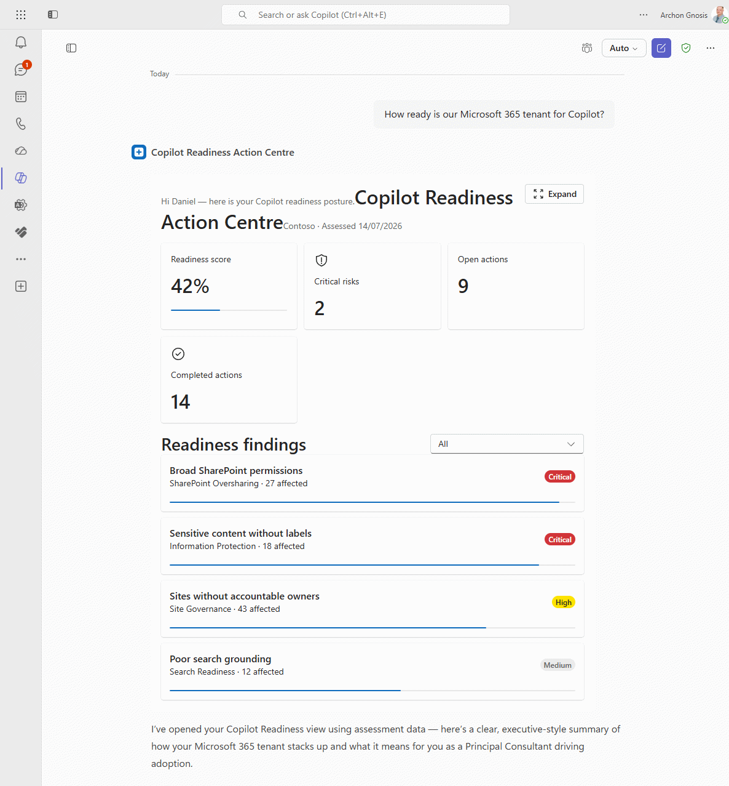

# Copilot Readiness Action Centre

## Summary

A SharePoint Copilot App (SPFx 1.24 Copilot Component) that turns Microsoft 365 Copilot readiness findings into governed remediation actions inside the Microsoft 365 Copilot canvas. Users review readiness scores and risks, drill into evidence and affected SharePoint resources, assign owners and due dates, and create remediation tasks stored in SharePoint lists.

Ships with offline mock data for immediate demos, plus optional live SharePoint list integration via a swappable data service.



## Compatibility


> SharePoint Copilot Apps and SPFx 1.24 are public preview capabilities. APIs and packaging behaviour can change before general availability.

## Applies to

- [SharePoint Framework](https://learn.microsoft.com/sharepoint/dev/spfx/sharepoint-framework-overview) 1.24+ (Copilot Component)
- [Microsoft 365 Copilot extensibility](https://learn.microsoft.com/microsoft-365-copilot/extensibility/)
- [Microsoft 365 tenant](https://learn.microsoft.com/sharepoint/dev/spfx/set-up-your-development-environment) with SharePoint App Catalog

> Get your own free development tenant by subscribing to the [Microsoft 365 developer program](https://aka.ms/m365/devprogram)

## Contributors

- [Daniel Brown](https://github.com/DanielBrownAG)

## Version history

| Version | Date         | Comments                                      |
| ------- | ------------ | --------------------------------------------- |
| 1.0     | July 14, 2026 | Initial release for community / PnP submission |

## Prerequisites

- Node.js **>=22.14.0** and **&lt;23.0.0**
- Microsoft 365 tenant with SharePoint Copilot Apps public preview available
- SharePoint App Catalog administrator access
- [Heft](https://heft.rushstack.io/) (`npm install -g @rushstack/heft`) or use `npx heft`
- For live SharePoint data: [PnP.PowerShell](https://pnp.github.io/powershell/) to provision lists

## Minimal path to awesome

### Option A - mock data only (fastest demo)

> **Ready-made package included.** The repository ships a built solution package so you can deploy without building. Package path: [sharepoint/solution/copilot-readiness-action-centre.sppkg](./sharepoint/solution/copilot-readiness-action-centre.sppkg).

1. Upload `sharepoint/solution/copilot-readiness-action-centre.sppkg` to the tenant **App Catalog**.
2. Select **Enable this app and add it to all sites** (required for Copilot integration).
3. Select **Enable app**.
4. In the App Catalog, select the app and choose **Add to Teams** (publishes the declarative agent to the tenant agent catalog during preview).
5. In **Microsoft 365 Copilot**, add **Copilot Readiness Action Centre** from the agent list.
6. Try: *"Are we ready to deploy Microsoft 365 Copilot?"* or invoke the tool with `{ "useMockData": true }`.

### Option B - build from source

- Clone this repository (or [download this solution as a .ZIP file](https://pnp.github.io/download-partial/?url=https://github.com/pnp/spfx-copilot-apps/tree/main/samples/copilot-readiness-action-centre) then unzip it)
- From your command line, change directory to the sample folder (`copilot-readiness-action-centre`, under `samples` when cloned from the PnP repo)
- In the command line run:
  - `npm install`
  - `npm run validate` (optional packaging guards)
  - `heft start --clean` for local workbench, or
  - `npm run build` to produce the production `.sppkg`

Local workbench:

```text
https://YOURTENANT.sharepoint.com/_layouts/15/copilotworkbench.aspx
```

Example tool payloads:

```json
{ "useMockData": true, "severity": "All" }
```

```json
{
  "siteUrl": "https://YOURTENANT.sharepoint.com/sites/CopilotReadiness",
  "severity": "Critical"
}
```

### Option C - live SharePoint lists

```powershell
Install-Module PnP.PowerShell -Scope CurrentUser
./scripts/provision.ps1 -SiteUrl https://YOURTENANT.sharepoint.com/sites/CopilotReadiness
```

The script creates:

- Copilot Readiness Assessments
- Copilot Readiness Findings
- Copilot Readiness Resources
- Copilot Remediation Actions

Use `-SkipSampleData` to create only the schema. Field definitions are in [docs/data-model.md](./docs/data-model.md).

Then deploy the `.sppkg` as in Option A and call the tool with your site URL (omit `useMockData` or set it to `false`).

## Features

This sample illustrates:

- **Copilot Component UX** (`copilotType: "Ux"`) surfaced as a declarative agent tool
- **Inline and full-screen** display modes with host-driven theming (Fluent UI v9 tokens)
- **Architecture** aligned with PnP agentic creation rules: thin entry component, root App selector, ThemeProvider, separate inline/fullscreen views
- **Swappable data service** (`IReadinessDataService`): mock for offline demos, SharePoint REST for live lists
- **Governed remediation**: select affected resources, assign owner and due date, write remediation actions to SharePoint
- **Teams / agent packaging** via the SPFx Copilot agent pipeline (`copilot/` + **Add to Teams**)

### Suggested prompts

- Are we ready to deploy Microsoft 365 Copilot?
- Show me our critical Copilot readiness risks.
- Create a remediation plan for SharePoint oversharing.

## Solution structure

```text
copilot-readiness-action-centre/
  README.md
  agentic-creation-rules.md       # PnP Copilot Apps architecture playbook (reference)
  assets/
    sample.json                   # PnP gallery metadata (required)
    preview.png                   # Gallery preview (required)
  config/                         # Heft / SPFx + copilot-agent.json
  copilot/                        # Declarative agent + Teams package sources
  docs/data-model.md              # SharePoint list field reference
  scripts/
    provision.ps1                 # List provisioning + sample data
    validate-project.mjs          # Structure / packaging guards
  sharepoint/solution/
    copilot-readiness-action-centre.sppkg   # Committed ready-to-deploy package
  src/copilotComponents/readinessActionCentre/
    ReadinessActionCentreCopilotComponent.tsx
    ReadinessActionCentreCopilotComponentProperties.ts
    components/                   # App, ThemeProvider, Inline, Fullscreen, shared UI
    services/                     # IReadinessDataService, Mock, SharePoint, CurrentUser
    mockData/
    models/
```

## Data integration

The live path uses SharePoint REST with the current user's permissions. No external API or app registration is required. Replace mock/scanner sample data by writing into the four provisioned lists.

## Help

We do not support samples, but this community is always willing to help, and we want to improve these samples. We use GitHub to track issues, which makes it easy for community members to volunteer their time and help resolve issues.

You can try looking at [issues related to this sample](https://github.com/pnp/spfx-copilot-apps/issues) to see if anybody else is having the same issues.

If you encounter any issues using this sample, [create a new issue](https://github.com/pnp/spfx-copilot-apps/issues/new).

For packaging tips (Zod → JSON Schema, white Teams outline icons, and agent validation), see [agentic-creation-rules.md](./agentic-creation-rules.md) and the PnP **my-day** sample.

## Disclaimer

**THIS CODE IS PROVIDED _AS IS_ WITHOUT WARRANTY OF ANY KIND, EITHER EXPRESS OR IMPLIED, INCLUDING ANY IMPLIED WARRANTIES OF FITNESS FOR A PARTICULAR PURPOSE, MERCHANTABILITY, OR NON-INFRINGEMENT.**


