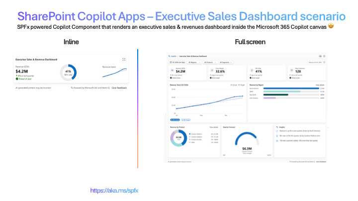
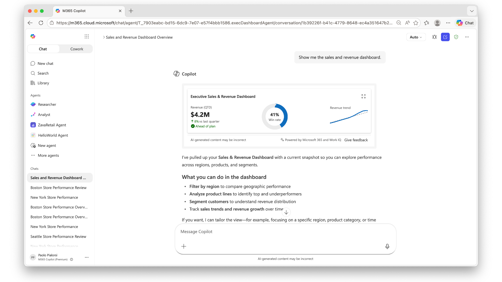
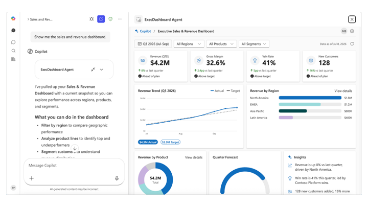

# Executive Sales & Revenue Dashboard

> An executive sales & revenue dashboard that lives inside the Microsoft 365 Copilot canvas — store performance and customer satisfaction at a glance.

     

## Summary

A **SharePoint Copilot App** that surfaces an **Executive Sales & Revenue Dashboard** directly inside Microsoft 365 Copilot. It renders a compact **inline** card and, on request, expands to a rich **full-screen** dashboard — switching automatically on the host `displayMode`.

The sample runs **fully offline**: all data is generated locally as Graph-shaped mock data on every render, with dates anchored to the current date/time. A data-service interface plus a `useMock` flag make switching to a real backend a drop-in change with no UI rework.



_Inline (left) + full-screen (right)._

## Screenshots & demo

| Inline | Full screen |
| --- | --- |
|  |  |

## Used SharePoint Framework Version


## Applies to

- [SharePoint Framework](https://aka.ms/spfx)
- [Microsoft 365 tenant](https://docs.microsoft.com/sharepoint/dev/spfx/set-up-your-developer-tenant)

> Get your own free development tenant by subscribing to the [Microsoft 365 developer program](http://aka.ms/o365devprogram).

## Prerequisites

- Node.js >=22.14.0 <23.0.0
- A Microsoft 365 tenant with SPFx 1.24 (dev preview) enabled
- SharePoint App Catalog site
- [Heft](https://heft.rushstack.io/) (`npm install -g @rushstack/heft`)
- Yeoman + `@microsoft/generator-sharepoint` (only needed to scaffold additional components)

> This solution uses the **Heft** build system (not Gulp), **React 17** functional components and **Fluent UI v9**, aligned with the SPFx 1.24 dev preview.

## Solution

| Solution          | Author(s)                                               |
| ----------------- | ------------------------------------------------------- |
| executive-sales-dashboard | Paolo Pialorsi (Microsoft) &#124; [GitHub](https://github.com/PaoloPia) &#124; [LinkedIn](https://www.linkedin.com/in/paolopialorsi/) |

## Version history

| Version | Date | Comments        |
| ------- | ---- | --------------- |
| 1.0     | 07.08.2026  | Initial release |

## Disclaimer

**THIS CODE IS PROVIDED _AS IS_ WITHOUT WARRANTY OF ANY KIND, EITHER EXPRESS OR IMPLIED, INCLUDING ANY IMPLIED WARRANTIES OF FITNESS FOR A PARTICULAR PURPOSE, MERCHANTABILITY, OR NON-INFRINGEMENT.**

---

## Minimal Path to Awesome

> **Ready-made package included.** Because this is a scenario sample that runs entirely on mock data - with no live customer data or line-of-business integration - the repository ships the fully built solution package so you can deploy and demo it in minutes without building anything. Grab the package here: [/sharepoint/solution/executive-sales-dashboard.sppkg](./sharepoint/solution/executive-sales-dashboard.sppkg).
>
> To use it, upload `executive-sales-dashboard.sppkg` to your tenant **App Catalog**, enable solution in all sites (includes Copilot), and invoke the agent in Microsoft 365 Copilot. Prefer to build from source instead? Follow the steps below.

- Clone this repository
- Ensure that you are at the solution folder (`executive-sales-dashboard`)
- In the command-line run:
  - `npm install -g @rushstack/heft`
  - `npm install`
  - `heft start --clean` — local dev server at `https://localhost:4321`
- Invoke the agent in Copilot and confirm the inline render, expand-to-full-screen, and dark/light theming.

Production build, test, and package:

```bash
heft test --clean --production && heft package-solution --production
```

Other build commands can be listed using `heft --help`.

## 60-second demo script

1. **Invoke it** - in Microsoft 365 Copilot, select the **ZavaRetail Agent** agent and send: _"Show me the sales and revenue dashboard"_ The compact **inline card** renders.
2. **Land the inline experience** (~10s) - call out the initial output with brief recap of performance (revenue, win rate, and revenue trend).
3. **Expand** (~10s) - select the **Expand to full screen** command on the upper right part of the card. The **full-screen dashboard** animates in - revenue, gross margin, win rate, new customers, revenue trend, revenue by region, revenue by product, quarter forecast, and insights.
4. **The "wow" moment** (~30s) - select **All Regions**, or **All Products**, or **All Segments** to filter data accordingly to your selection. The whole dashboard dynamically updates accordingly to your settings. Explain the audience that all the data is dynamic.
5. **Theming** (~10s) - flip the Copilot host to **dark mode** to show the whole experience re-theme instantly.

> Tip: the day is always "today" and data follows current calendar, whenever you demo.

## Features

This sample illustrates the following concepts:

- A single SPFx **Copilot Component** that renders both **inline** and **full-screen** experiences, chosen from `hostContext.displayMode`.
- **Host-driven theming** (light/dark) via a single stable-key Fluent v9 `FluentProvider`.
- A **data-service abstraction** (`IExecDashboardDataService`) with a shipped mock implementation and a stubbed real implementation, selected by a `useMock` flag / `dataServiceUrl` property.
- A **settings panel** (gear icon) that toggles `useMock` and configures the data endpoint.
- **Filters** (region / product / segment) that meaningfully reshape the mock data.
- A **data-loading state** (`isDataLoading`) with a spinner.
- Fully **offline SVG charts**: KPI cards, actual-vs-target trend, revenue by region/product, and a quarter-forecast gauge.
- A **static footer**: AI disclaimer, "Powered by Microsoft 365 and Work IQ", and a feedback action.
- The current user rendered from a **mock persona** (mock mode) or **Microsoft Graph** (`/me`) when live.

## Data source

All data is mock data generated on the client by `mockData/salesData.ts`, shaped so a real
`IExecDashboardDataService` implementation can be swapped in without UI changes. Dates and
the reporting period are derived from the render time, so the dashboard always reads as
current.

## Solution structure

```text
src/copilotComponents/execDashboard/
  ExecDashboardCopilotComponent.tsx        # SPFx host adapter
  ExecDashboardCopilotComponentProperties.ts # useMock + dataServiceUrl (Zod schema)
  components/
    ExecDashboard.tsx                      # root selector (loading, data, mode switch)
    ExecDashboardThemeProvider.tsx         # single Fluent v9 provider (host theme)
    ExecDashboardInline.tsx                # inline experience
    ExecDashboardFullscreen.tsx            # full-screen experience
    inline/                                # inline building blocks
    fullscreen/                            # KPI cards, charts, filter bar, settings panel
    shared/                                # footer, donut, spinner, delta badge
  models/                                  # view models
  services/                                # data-service interface, mock, real (stub), factory
  mockData/                                # sales + people mock data
  utils/                                   # datetime, format, colors, settings, motion
```

## References

- [Getting started with SharePoint Framework](https://docs.microsoft.com/sharepoint/dev/spfx/set-up-your-developer-tenant)
- [Use Microsoft Graph in your solution](https://docs.microsoft.com/sharepoint/dev/spfx/web-parts/get-started/using-microsoft-graph-apis)
- [Fluent UI React v9](https://react.fluentui.dev/)
- [Microsoft 365 Patterns and Practices](https://aka.ms/m365pnp) - Guidance, tooling, samples and open-source controls for your Microsoft 365 development
- [Heft Documentation](https://heft.rushstack.io/)

---

_Part of the **SharePoint Copilot Apps** sample gallery — complex UX in the Copilot canvas, powered by SPFx. See [aka.ms/spfx](https://aka.ms/spfx)._