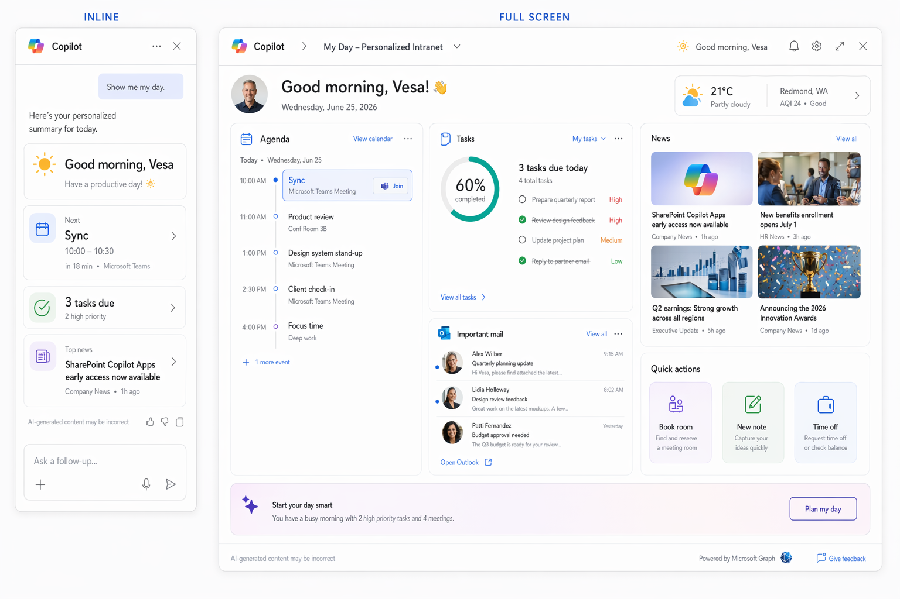

# My Day — Personalized Intranet

> The emotional 'this is MY workday' hook — perfect for the keynote.

     

## Summary

Copilot opens to a living personal cockpit — greeting, next meeting, tasks and news — then expands to a full personal dashboard. Maximum relatability for a launch demo.

This is a **SharePoint Copilot App** built as an SPFx 1.24 **Copilot Component** (`MyDay`). The same React component renders in two modes inside the Copilot canvas — a compact **inline** card and an immersive **full-screen** experience — and can also be surfaced as a classic web part.

## Concept mockup



*Inline (left) + full-screen (right). Replace with real screenshots once the component is built.*

## Screenshots & demo

> 🖼️ **Image placeholders** — replace the files in `./assets/` with real captures during the build.

| Inline | Full screen |
| --- | --- |
|  |  |


## Business value

The emotional 'this is MY workday' hook — perfect for the keynote. Target audience: **enterprise customers and ISV/SI builders**. Uses mocked data so anyone can deploy and demo in minutes — no LOB integration required.

## UX components

Cards · agenda timeline · tasks ring · news wall · quick-action tiles

## Data source

Microsoft Graph (`/me`, `/me/events`, `/me/messages`, `/me/planner/tasks`); news from list **`News`**. Mock fallback in `/sampledata`.

> All data is **mocked** for the sample. A swappable data service exposes a `useMock` flag — `true` for offline demos, `false` to read the live SharePoint list / Microsoft Graph.

## Inline experience

Time-aware greeting + next-meeting card + *tasks due today* summary + top news headline.

## Full-screen experience

Responsive card grid — Agenda (today's timeline), Tasks (checklist + completion ring), News wall (image cards), Important mail, and a quick-actions row.

## Wireframe

```text
INLINE  ☀ Good morning, Vesa   ▸ Next: Sync 10:00 (12m)   ✓ 3 tasks due   📰 "SPFx Copilot Apps ships"

FULL    ┌ Agenda timeline ┐┌ Tasks ◔ ┐
        ├ News wall (cards)┤├ Mail   ┤   + quick actions: [Book room] [New note] [Time off]
```

## Build it with GitHub Copilot

Paste these prompts into **GitHub Copilot Chat** with the SPFx 1.24 Copilot Component scaffold open. Assumes React + TypeScript, Fluent UI v9, theme-aware (dark/light from the canvas), and a swappable data service.

### Inline prompt

```text
Create SPFx Copilot Component MyDay, inline mode, React+TS+Fluent v9. Show a time-aware greeting with the user's first name (/me), the next meeting card (/me/events), a 'tasks due today' summary (/me/planner/tasks), and the top news headline from SharePoint list News. Use GraphService with mock fallback. Theme-aware, responsive, accessible.
```

### Full-screen prompt

```text
Add full-screen mode to MyDay: a responsive card grid — Agenda (today's vertical timeline from /me/events), Tasks (checklist with completion ring), News wall (image cards from News), Important mail (/me/messages, isImportant), and a quick-actions row (Book room, New note, Request time off). Masonry-style layout, theme-aware, smooth load animations, full a11y.
```

## Run & deploy

```bash
# 1. Scaffold (choose the "Copilot Component" type)
yo @microsoft/sharepoint

# 2. Provision the mock data list(s) from /sampledata (PnP template)
#    — or keep useMock = true for a fully offline demo

# 3. Develop & preview in the Copilot Component Workbench
gulp serve

# 4. Package and deploy to the tenant App Catalog
gulp bundle --ship && gulp package-solution --ship
```

Then invoke the agent in Copilot and confirm the inline render, expand-to-full-screen, filtering and dark/light theming.

## Applies to

- [SharePoint Framework 1.24+](https://aka.ms/spfx) (Copilot Component)
- Microsoft 365 Copilot
- Microsoft 365 tenant with the SharePoint App Catalog

## Prerequisites

- Node.js 18.x, gulp-cli, Yeoman + `@microsoft/generator-sharepoint`
- A Microsoft 365 tenant with SPFx 1.24 (public preview) enabled

## Folder structure

```text
05-my-day-intranet/
  README.md
  assets/
    concept-mockup.png          # provided concept visual
    screenshot-inline.png       # placeholder — replace
    screenshot-fullscreen.png   # placeholder — replace
    demo.gif                    # placeholder — replace
  src/                          # add your SPFx solution here
  sampledata/                   # mock JSON + PnP provisioning template
```

---

*Part of the **SharePoint Copilot Apps** sample gallery — complex UX in the Copilot canvas, powered by SPFx. See [aka.ms/spfx](https://aka.ms/spfx).*
