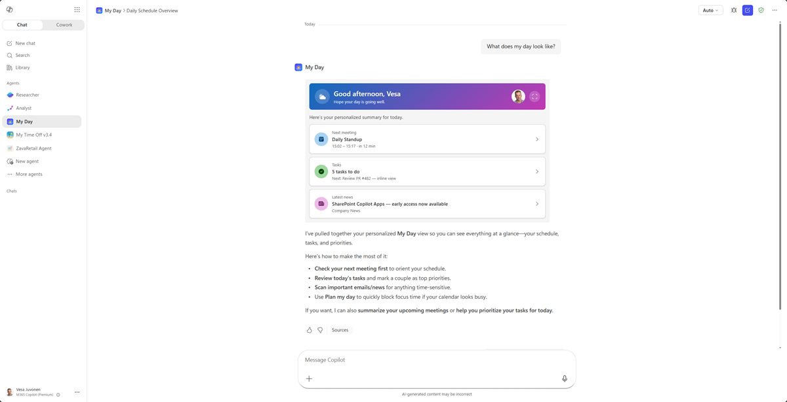

# My Day — Personalized Intranet Copilot App

> The emotional "this is MY workday" hook — a personal cockpit that lives inside the Microsoft 365 Copilot canvas.

    

## Summary

**My Day** is a **SharePoint Copilot App** built as an SPFx 1.24 **Copilot Component** (not a classic web part). Copilot opens to a living personal cockpit — greeting, next meeting, tasks and news — then expands to a full personal dashboard. Maximum relatability for a launch demo.

The same React component renders in two modes inside the Copilot canvas:

- a compact **inline** card, and
- an immersive **full-screen** experience.

The sample ships with **mocked data** so anyone can deploy and demo in minutes — no line-of-business integration required. A swappable data service exposes a `useMock` flag (`true` for offline demos, `false` to read the live SharePoint list / Microsoft Graph).


_Inline (left) + full-screen (right)._

## Screenshots & demo

| Inline | Full screen |
| --- | --- |
|  |  |


## Used SharePoint Framework Version


## Applies to

- [SharePoint Framework](https://aka.ms/spfx) 1.24+ (Copilot Component)
- [Microsoft 365 Copilot](https://www.microsoft.com/microsoft-365/copilot)
- [Microsoft 365 tenant](https://docs.microsoft.com/sharepoint/dev/spfx/set-up-your-developer-tenant) with the SharePoint App Catalog

> Get your own free development tenant by subscribing to the [Microsoft 365 developer program](http://aka.ms/o365devprogram)

## Prerequisites

- Node.js >=22.14.0 <23.0.0
- A Microsoft 365 tenant with SPFx 1.24 (dev preview) enabled
- SharePoint App Catalog site
- [Heft](https://heft.rushstack.io/) (`npm install -g @rushstack/heft`)
- Yeoman + `@microsoft/generator-sharepoint` (only needed to scaffold additional components)

> This solution uses the **Heft** build system (not Gulp) and **React 17** functional components, aligned with the SPFx 1.24 dev preview.

## Solution

| Solution | Author(s)                                               |
| -------- | ------------------------------------------------------- |
| my-day   | Author details (name, company, twitter alias with link) |

## Version history

| Version | Date | Comments        |
| ------- | ---- | --------------- |
| 1.0     | TBD  | Initial release |

## Disclaimer

**THIS CODE IS PROVIDED _AS IS_ WITHOUT WARRANTY OF ANY KIND, EITHER EXPRESS OR IMPLIED, INCLUDING ANY IMPLIED WARRANTIES OF FITNESS FOR A PARTICULAR PURPOSE, MERCHANTABILITY, OR NON-INFRINGEMENT.**

---

## Minimal Path to Awesome

- Clone this repository
- Ensure that you are at the solution folder (`samples/my-day`)
- In the command-line run:
  - `npm install -g @rushstack/heft`
  - `npm install`
  - `heft start --clean` — local dev server at `https://localhost:4321`
- Invoke the agent in Copilot and confirm the inline render, expand-to-full-screen, and dark/light theming.

Production build, test, and package:

```bash
heft test --clean --production && heft package-solution --production
```

Other build commands can be listed using `heft --help`.

## Features

My Day demonstrates how to build a rich, theme-aware UX inside the Microsoft 365 Copilot canvas using an SPFx Copilot Component.

This sample illustrates the following concepts:

- **Copilot Component UX** — a `CopilotComponent` (`copilotType: "Ux"`) surfaced as a tool a declarative agent can call, rendering its own React UI inside the Copilot host.
- **Display-mode-aware rendering** — a single root React component selects a dedicated **inline** or **full-screen** view from the host-advertised display mode; inline can request expansion via `requestDisplayModeAsync('fullscreen')`.
- **Swappable data service** — Microsoft Graph + SharePoint list access behind a `useMock` flag, with mock JSON fallback for fully offline demos.
- **Theme awareness** — light/dark theme driven by the Copilot host context.

### UX components

Cards · agenda timeline · tasks ring · news wall · quick-action tiles

### Inline experience

Time-aware greeting + next-meeting card + _tasks due today_ summary + top news headline.

### Full-screen experience

Responsive card grid — Agenda (today's timeline), Tasks (checklist + completion ring), News wall (image cards), Important mail, and a quick-actions row.

### Wireframe

```text
INLINE  ☀ Good morning, Vesa   ▸ Next: Sync 10:00 (12m)   ✓ 3 tasks due   📰 "SPFx Copilot Apps ships"

FULL    ┌ Agenda timeline ┐┌ Tasks ◔ ┐
        ├ News wall (cards)┤├ Mail   ┤   + quick actions: [Book room] [New note] [Time off]
```

## Data source

Microsoft Graph (`/me`, `/me/events`, `/me/messages`, `/me/planner/tasks`); news from the SharePoint list **`News`**. All data is **mocked** for the sample via a swappable data service (`useMock` flag).

## Solution structure

```text
samples/my-day/
  README.md
  assets/
    concept-mockup.png
    screenshot-inline.png
    screenshot-fullscreen.png
    demo.gif
  config/                       # Heft / SPFx + Copilot agent configuration
  copilot/                      # declarative agent + plugin manifests
  src/
    copilotComponents/
      myDay/
        MyDayCopilotComponent.ts             # entry point (mounts React)
        MyDayCopilotComponent.manifest.json  # component + tools manifest
        MyDayCopilotComponentProperties.ts   # Zod tool-input schema
        components/
          MyDayApp.tsx          # root selector (inline vs. full-screen)
          MyDayInline.tsx       # inline display-mode view
          MyDayFullscreen.tsx   # full-screen display-mode view
```

## References

- [Getting started with SharePoint Framework](https://docs.microsoft.com/sharepoint/dev/spfx/set-up-your-developer-tenant)
- [Use Microsoft Graph in your solution](https://docs.microsoft.com/sharepoint/dev/spfx/web-parts/get-started/using-microsoft-graph-apis)
- [Heft Documentation](https://heft.rushstack.io/)
- [PnPjs](https://pnp.github.io/pnpjs/)
- [PnP React controls](https://pnp.github.io/sp-dev-fx-controls-react/)
- [Microsoft 365 & Power Platform Community](https://aka.ms/community/home) - Guidance, tooling, samples and open-source controls for your Copilot, Microsoft 365 & Power Platform development

---

> Notice that better pictures and documentation will increase the sample usage and the value you are providing for others. Thanks for your submissions in advance.

> Share your solution with others through the Microsoft 365 Patterns and Practices program to get visibility and exposure. More details on the community, open-source projects and other activities from http://aka.ms/community/home.

_Part of the **SharePoint Copilot Apps** sample gallery — complex UX in the Copilot canvas, powered by SPFx. See [aka.ms/spfx](https://aka.ms/spfx)._