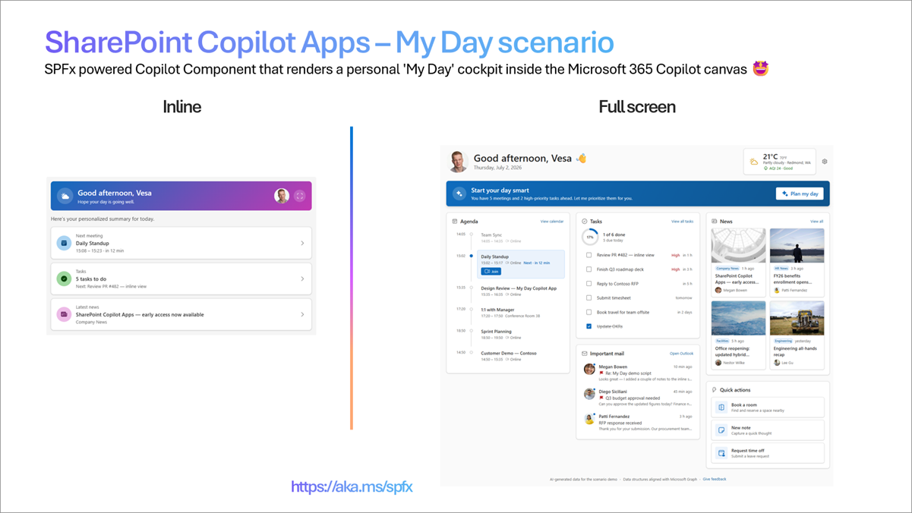
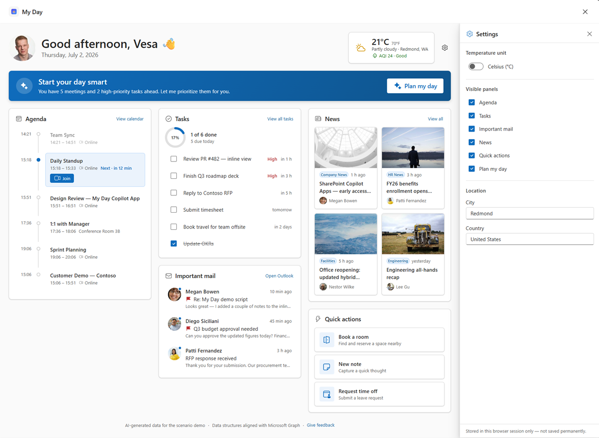
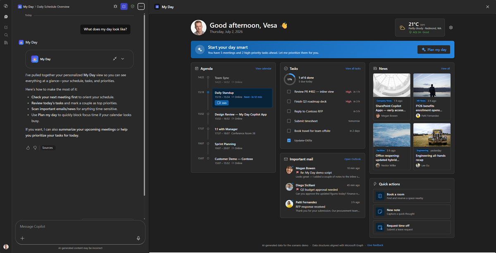

# My Day - Personalized Intranet Copilot App

    

## Summary

**My Day** is a **SharePoint Copilot App** built as an SPFx 1.24 **Copilot Component** (not a classic web part). Copilot opens to a living personal cockpit - greeting, next meeting, tasks and news - then expands to a full personal dashboard. Maximum relatability for a launch demo.

The same React component renders in two modes inside the Copilot canvas:

- a compact **inline** card, and
- an immersive **full-screen** dashboard with a **"Plan my day"** focus assistant and a **settings** drawer.

The sample ships with **mocked data** so anyone can deploy and demo in minutes - no line-of-business integration required. The data is served through a swappable `IMyDayDataService` interface, so the mock implementation can be replaced by a live Microsoft Graph / SharePoint implementation without touching the UI.



_Inline (left) + full-screen (right)._

## Screenshots & demo

### Inline


### Full screen


### Settings (session-persisted)



### Dark mode



## Used SharePoint Framework Version


## Applies to

- [SharePoint Framework](https://aka.ms/spfx) 1.24+ (Copilot Component)
- [Microsoft 365 Copilot](https://www.microsoft.com/microsoft-365/copilot)
- [Microsoft 365 tenant](https://docs.microsoft.com/sharepoint/dev/spfx/set-up-your-developer-tenant) with the SharePoint App Catalog

> Get your own free development tenant by subscribing to the [Microsoft 365 developer program](http://aka.ms/o365devprogram)

## Prerequisites

- Node.js >=22.14.0 <23.0.0
- A Microsoft 365 tenant with SPFx 1.24 (dev preview) enabled
- SharePoint App Catalog site
- [Heft](https://heft.rushstack.io/) (`npm install -g @rushstack/heft`)
- Yeoman + `@microsoft/generator-sharepoint` (only needed to scaffold additional components)

> This solution uses the **Heft** build system (not Gulp) and **React 17** functional components, aligned with the SPFx 1.24 dev preview.

## Solution

| Solution | Author(s)                                               |
| -------- | ------------------------------------------------------- |
| my-day   | Vesa Juvonen (Microsoft) &#124; [GitHub](https://github.com/vesajuvonen) &#124; [LinkedIn](https://www.linkedin.com/in/vesajuvonen/) |

## Version history

| Version | Date | Comments        |
| ------- | ---- | --------------- |
| 1.0     | 7.2.2026  | Initial version |

## Disclaimer

**THIS CODE IS PROVIDED _AS IS_ WITHOUT WARRANTY OF ANY KIND, EITHER EXPRESS OR IMPLIED, INCLUDING ANY IMPLIED WARRANTIES OF FITNESS FOR A PARTICULAR PURPOSE, MERCHANTABILITY, OR NON-INFRINGEMENT.**

---

## Minimal Path to Awesome

> **Ready-made package included.** Because this is a scenario sample that runs entirely on mock data - with no live customer data or line-of-business integration - the repository ships the fully built solution package so you can deploy and demo it in minutes without building anything. Grab the package here: [sharepoint/solution/my-day.sppkg](./sharepoint/solution/my-day.sppkg).
>
> To use it, upload `my-day.sppkg` to your tenant **App Catalog**, enable solution in all sites (includes Copilot), and invoke the agent in Microsoft 365 Copilot. Prefer to build from source instead? Follow the steps below.

- Clone this repository
- Ensure that you are at the solution folder (`samples/my-day`)
- In the command-line run:
  - `npm install -g @rushstack/heft`
  - `npm install`
  - `heft start --clean` - local dev server at `https://localhost:4321`
- Invoke the agent in Copilot and confirm the inline render, expand-to-full-screen, dark/light theming, the **Plan my day** briefing, and the **settings** drawer (toggle temperature units and panel visibility to see the layout re-flow).

Production build, test, and package:

```bash
heft test --clean --production && heft package-solution --production
```

Other build commands can be listed using `heft --help`.

## 60-second demo script

A tight, repeatable flow for a live demo. All data is mock, so it works the same every time.

1. **Invoke it** - in Microsoft 365 Copilot, select the **My Day** agent and send: _"What does my day look like?"_ The compact **inline card** renders.
2. **Land the personal hook** (~10s) - call out the greeting using the **real signed-in user's name and photo**, the time-aware sub-line, and the dynamic summary ("You have 3 meetings and 2 high-priority tasks ahead."). Tap a tile (Next meeting / Tasks) to show the inline drill-down, then back.
3. **Expand** (~10s) - click the **expand** control on the greeting card. The **full-screen dashboard** animates in - agenda timeline, tasks completion ring, important mail with face avatars, a news wall with real thumbnails, and the weather card.
4. **The "wow" moment** (~15s) - click **Plan my day**. Watch the assistant "think" and then **stream in** a prioritized, deterministic focus briefing that opens with the user's name and reads as one connected story (prep the Design Review → review the inline-view PR → polish the demo script → reply to Megan).
5. **Show settings shaping the UX** (~15s) - open the **gear** ⚙️. Toggle **°C / °F** and point out the hero weather updating live; uncheck a panel (e.g. **News**) and watch the layout **re-flow**. Note the footnote: settings are stored in this browser **session only**.
6. **Theming** (~10s) - flip the Copilot host to **dark mode** to show the whole experience re-theme instantly.

> Tip: the day is always "today" and time-of-day aware, so the agenda, greeting and Plan my day stay believable whenever you demo.

## Features

My Day demonstrates how to build a rich, theme-aware UX inside the Microsoft 365 Copilot canvas using an SPFx Copilot Component.

This sample illustrates the following concepts:

- **Copilot Component UX** - a `CopilotComponent` (`copilotType: "Ux"`) surfaced as a tool a declarative agent can call, rendering its own React UI inside the Copilot host.
- **Display-mode-aware rendering** - a single root React component selects a dedicated **inline** or **full-screen** view from the host-advertised display mode; inline can request expansion via `requestDisplayModeAsync('fullscreen')`.
- **Swappable data service** - all data flows through an `IMyDayDataService` interface (mock implementation shipped), so a live Microsoft Graph / SharePoint implementation can be dropped in without changing the UI.
- **Theme awareness** - light/dark theme driven by the Copilot host context, using Fluent UI v9 theme tokens (no hardcoded colors).
- **"Plan my day" focus assistant** - a read-only, deterministically generated focus briefing derived from the day's mock data (no chat, no real AI/WorkIQ call) that shifts with the time of day.
- **Session-persisted settings** - a settings drawer whose values are **intentionally** stored in the browser session (`sessionStorage`) to show how configuration can shape the dashboard, without any server-side persistence.
- **Dynamic, visibility-driven layout** - the full-screen grid re-flows to the number of visible panels and the available width (3 → 2 → 1) with no fixed breakpoints.

### UX components

Cards · agenda timeline · tasks ring · news wall · quick-action tiles · weather card · Plan my day panel · settings drawer

### Inline experience

Time-aware greeting + next-meeting card + _tasks due today_ summary + top news headline, with drill-down views and an expand-to-full-screen affordance.

### Full-screen experience

Responsive card grid - Agenda (today's timeline), Tasks (checklist + completion ring), Important mail (with sender face avatars), News wall (image cards), a quick-actions row, and a weather card in the hero. A **"Plan my day"** banner opens a prioritized focus briefing, and a **settings** drawer lets the user switch temperature units, edit location, and show/hide panels - all persisted for the browser session and reflected live in the dashboard.

### Settings & session persistence

The settings drawer is **controlled by session-scoped state** (`sessionStorage`), intentionally chosen for the demo so changes survive reloads within the session but are forgotten when it ends:

- **Temperature unit** (°C / °F) - applied live to the hero weather card.
- **Location** (city / country) - illustrative inputs, persisted for the session.
- **Visible panels** - toggles each dashboard panel; the layout re-flows dynamically and at least one panel always stays visible.

### Wireframe

```text
INLINE  ☀ Good morning, Vesa   ▸ Next: Sync 10:00 (12m)   ✓ 3 tasks due   📰 "SPFx Copilot Apps ships"

FULL    ┌ Agenda timeline ┐┌ Tasks ◔ ┐┌ News wall ┐
        │  (dynamic grid) ││  Mail   ││ Quick a.  │   + "Plan my day" briefing · settings drawer
        └─────────────────┘└─────────┘└───────────┘
```

## Data source

All data is **mocked** for the sample and served through the `IMyDayDataService` interface (`MockMyDayDataService`), so the views never call an API directly. The mock is shaped to mirror Microsoft Graph so a live implementation is a drop-in replacement:

- user → `/me` + `/me/photo/$value`
- calendar → `/me/events` (or `/me/calendarView`)
- tasks → `/me/todo/lists/{id}/tasks`
- mail → `/me/messages`
- news → SharePoint site pages / a **`News`** list

The **"Plan my day"** briefing is produced by a pure `planMyDay(data, now)` function (deterministic, derived from the mock) - no real AI/WorkIQ call is made.

## Solution structure

```text
samples/my-day/
  README.md
  todo.md                       # build log / reference checklist for similar samples
  assets/                       # concept mockup, screenshots, demo GIF, face avatars
  config/                       # Heft / SPFx + Copilot agent configuration
  copilot/                      # declarative agent + plugin manifests
  src/
    copilotComponents/
      myDay/
        MyDayCopilotComponent.ts             # entry point (mounts React)
        MyDayCopilotComponent.manifest.json  # component + tools manifest
        MyDayCopilotComponentProperties.ts   # Zod tool-input schema
        components/
          MyDayApp.tsx          # root selector (inline vs. full-screen)
          MyDayThemeProvider.tsx# host light/dark → FluentProvider
          MyDayInline.tsx       # inline display-mode view
          MyDayFullscreen.tsx   # full-screen display-mode view
          inline/               # inline building blocks (greeting, summary, lists)
          fullscreen/           # dashboard cards, Plan my day + settings drawers
        models/                 # Graph-shaped + UI view models
        services/               # IMyDayDataService, mock service, planMyDay, mappers
        mockData/               # static mock data (meetings, tasks, news, mail, weather…)
        utils/                  # datetime, greeting, session-persisted settings
```

## References

- [Getting started with SharePoint Framework](https://docs.microsoft.com/sharepoint/dev/spfx/set-up-your-developer-tenant)
- [Use Microsoft Graph in your solution](https://docs.microsoft.com/sharepoint/dev/spfx/web-parts/get-started/using-microsoft-graph-apis)
- [Heft Documentation](https://heft.rushstack.io/)
- [PnPjs](https://pnp.github.io/pnpjs/)
- [PnP React controls](https://pnp.github.io/sp-dev-fx-controls-react/)
- [Microsoft 365 & Power Platform Community](https://aka.ms/community/home) - Guidance, tooling, samples and open-source controls for your Copilot, Microsoft 365 & Power Platform development

---

> Notice that better pictures and documentation will increase the sample usage and the value you are providing for others. Thanks for your submissions in advance.

> Share your solution with others through the Microsoft 365 Patterns and Practices program to get visibility and exposure. More details on the community, open-source projects and other activities from http://aka.ms/community/home.

_Part of the **SharePoint Copilot Apps** sample gallery - complex UX in the Copilot canvas, powered by SPFx. See [aka.ms/spfx](https://aka.ms/spfx)._


