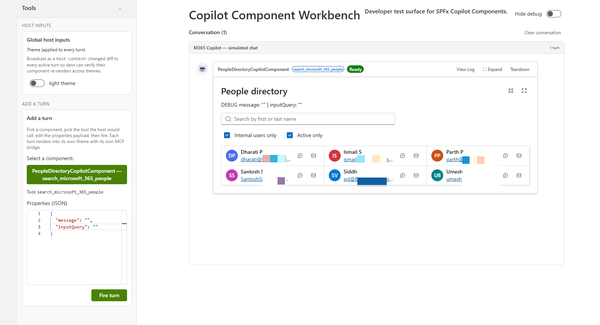
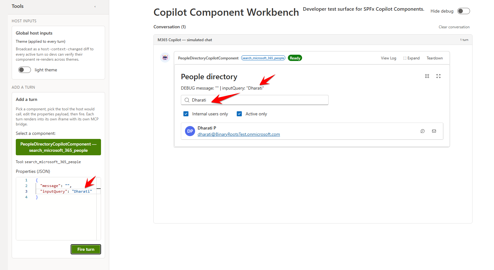
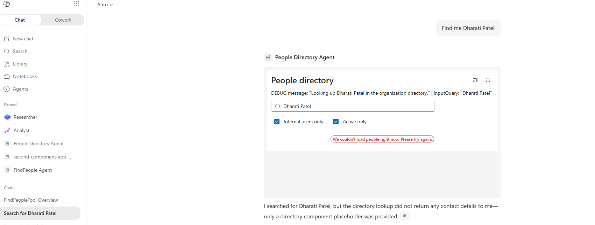

# People Directory - Find Microsoft 365 People in Copilot Chat

## Summary

**People Directory** is an SPFx **Copilot Component** that brings Microsoft 365 people search directly into the Microsoft 365 Copilot canvas. A declarative agent ("People Directory Agent") calls it as a tool, and it renders a live, interactive people search inline in the conversation or as a fullscreen overview, reading real directory data through the Microsoft Graph `/users` API.

From the rendered UI, the signed-in user can:

- Search Microsoft 365 users by name, with the search term extracted automatically from their Copilot request
- Filter results to internal users only, and/or active (enabled) accounts only
- See each match's presence-aware persona photo, display name, and email
- Start a Teams chat or send an email to any listed person directly from the result row
- Resize the inline card or expand it to a fullscreen view







## Used SharePoint Framework Version


## Applies to

- [SharePoint Framework](https://learn.microsoft.com/sharepoint/dev/spfx/sharepoint-framework-overview) 1.24+ (Copilot Component)
- [Microsoft 365 Copilot extensibility](https://learn.microsoft.com/microsoft-365-copilot/extensibility/)
- [Microsoft 365 tenant](https://learn.microsoft.com/sharepoint/dev/spfx/set-up-your-development-environment)

> Get your own free development tenant by subscribing to the [Microsoft 365 developer program](https://aka.ms/m365/devprogram)

## Prerequisites

This solution reads live directory data through the Microsoft Graph `/users` endpoint (beta) via the SPFx-brokered `MSGraphClientV3` client. `config/package-solution.json` does not currently declare a `webApiPermissionRequests` block for this, so before relying on it in a tenant, add and admin-approve a Graph delegated permission such as `User.ReadBasic.All` (or `User.Read.All` if additional profile fields are needed) in **SharePoint Admin Center → Advanced → API access**.

## Solution

| Solution         | Author(s)                                                          |
| ---------------- | ------------------------------------------------------------------- |
| people-directory | Siddharth Vaghasia ([siddharth-vaghasia](https://github.com/siddharth-vaghasia)) |

## Version history

| Version | Date             | Comments        |
| ------- | ---------------- | --------------- |
| 1.0.0.0 | July 13, 2026     | Initial release |

## Disclaimer

**THIS CODE IS PROVIDED _AS IS_ WITHOUT WARRANTY OF ANY KIND, EITHER EXPRESS OR IMPLIED, INCLUDING ANY IMPLIED WARRANTIES OF FITNESS FOR A PARTICULAR PURPOSE, MERCHANTABILITY, OR NON-INFRINGEMENT.**

---

## Minimal Path to Awesome

- Clone this repository
- Ensure that you are at the solution folder
- In the command-line run:
  - `npm install -g @rushstack/heft`
  - `npm install`
  - `npm run start`
- Since SPFx Copilot Components can't be tested in the local workbench, `npm run start` serves against a hosted tenant workbench (see [`.vscode/launch.json`](./.vscode/launch.json) and [`config/serve.json`](./config/serve.json))
- Package and deploy the solution to your **App Catalog**, grant the Graph permission noted under Prerequisites, then invoke the **People Directory Agent** in Microsoft 365 Copilot

Other build commands can be listed using `heft --help`.

## Features

People Directory demonstrates how to surface Microsoft 365 people search inside the Copilot canvas using an SPFx Copilot Component, reading live directory data rather than mock content.

This sample illustrates the following concepts:

- **Copilot Component UX** — a `CopilotComponent` (`copilotType: "Ux"`) exposed as a tool (`search_microsoft_365_people`) that a declarative agent can call, rendering its own React UI inside the Copilot host.
- **Display-mode-aware rendering** — a single React component (`PeopleDirectory.tsx`) renders a compact inline list or a fullscreen overview based on the host-advertised display mode (`inline` / `fullscreen`), and can request a mode switch or size change through the Copilot bridge.
- **Brokered SSO to Microsoft Graph** — user search and profile photos go through the SPFx-brokered `MSGraphClientV3` client, with no manual token handling.
- **Live Microsoft Graph people search** — queries `/users` (beta, with `$search`, `$filter`, and `ConsistencyLevel: eventual`) to find people by name, and can filter to internal-only or active-only accounts.
- **Tool argument extraction** — the tool's `inputQuery` argument (defined via Zod in [`PeopleDirectoryCopilotComponentProperties.ts`](./src/copilotComponents/peopleDirectory/PeopleDirectoryCopilotComponentProperties.ts)) instructs Copilot to extract just the search term from the user's natural-language request.
- **Theme awareness** — light/dark theme driven by the Copilot host context, using Fluent UI v9 theme tokens throughout.

> Notice that better pictures and documentation will increase the sample usage and the value you are providing for others. Thanks for your submissions advance.

> Share your web part with others through Microsoft 365 Patterns and Practices program to get visibility and exposure. More details on the community, open-source projects and other activities from http://aka.ms/m365pnp.

## Some Advance Concepts Explored

### Adding a new tool parameter that Copilot can populate

The tool's input parameters are defined once, as a [Zod](https://zod.dev/) schema, in [`PeopleDirectoryCopilotComponentProperties.ts`](./src/copilotComponents/peopleDirectory/PeopleDirectoryCopilotComponentProperties.ts) and converted to JSON Schema via `zod-to-json-schema`:

```ts
const propertiesSchema = z.object({
  message: z.string().describe('A message to display.'),
  inputQuery: z.string().describe('REQUIRED. The exact name or search term to look up ...')
});
```

The compiled JSON Schema is referenced by the component's manifest, which is how the Copilot host discovers the tool's parameters and their descriptions. To add a new parameter:

1. Add a field to the `z.object({...})` above, with a `.describe(...)` that tells Copilot what to extract and when (mark it required/optional, describe the expected format, and give worked examples of phrases → values).
2. Read the new field off `props` (or `props.message`/`props.inputQuery`'s siblings) in [`PeopleDirectoryCopilotComponent.tsx`](./src/copilotComponents/peopleDirectory/PeopleDirectoryCopilotComponent.tsx) / [`PeopleDirectory.tsx`](./src/copilotComponents/peopleDirectory/components/PeopleDirectory.tsx) and use it to drive the component's behavior.


### Instructing the agent to infer a parameter from user intent

Two things work together to make Copilot infer `inputQuery` from a freeform request rather than asking the user to fill in a form field:

- The Zod `.describe()` text on the parameter itself (above) is the primary signal — it tells Copilot's tool-calling model what to extract, gives extraction examples, and states the empty-string fallback when nothing was named.
- The declarative agent's [`instruction.txt`](./copilot/instruction.txt) reinforces and generalizes that behavior at the agent level: it tells the agent that every call to `search_microsoft_365_people` **must** include `inputQuery`, lists the filler phrases to strip ("find", "search for", "who is", ...), and gives before/after examples (e.g. `"find me Dharati Patel"` → `inputQuery: "Dharati Patel"`), plus an explicit instruction never to invent a name the user didn't provide.

Together these let the agent turn a natural-language ask like *"who is Dharati Patel?"* directly into a tool call with `inputQuery: "Dharati Patel"`, with no intermediate clarifying question.

### SPFx React control library used in the Copilot Component

Alongside Fluent UI v9 (`@fluentui/react-components`, used for the overall layout, `SearchBox`, `Checkbox`, buttons) and a Fluent UI v8 `Persona`/`PersonaSize` import for sizing constants, this sample pulls in [`@pnp/spfx-controls-react`](https://pnp.github.io/sp-dev-fx-controls-react/) for its **`LivePersona`** control ([`components/PeopleDirectory.tsx`](./src/copilotComponents/peopleDirectory/components/PeopleDirectory.tsx)):

## References

- [Getting started with SharePoint Framework](https://learn.microsoft.com/sharepoint/dev/spfx/set-up-your-development-environment)
- [Microsoft 365 Copilot extensibility](https://learn.microsoft.com/microsoft-365-copilot/extensibility/)
- [Use Microsoft Graph in your solution](https://learn.microsoft.com/sharepoint/dev/spfx/web-parts/get-started/using-microsoft-graph-apis)
- [Publish SharePoint Framework applications to the Marketplace](https://learn.microsoft.com/sharepoint/dev/spfx/publish-to-marketplace-overview)
- [Microsoft 365 Patterns and Practices](https://aka.ms/m365pnp) - Guidance, tooling, samples and open-source controls for your Microsoft 365 development
- [Heft Documentation](https://heft.rushstack.io/)
