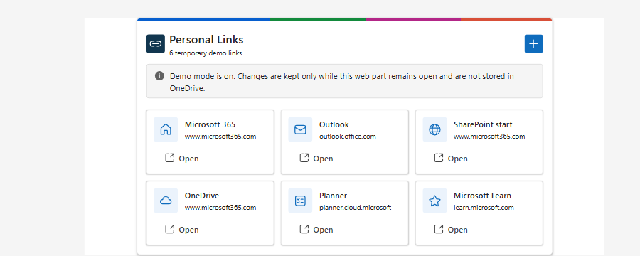
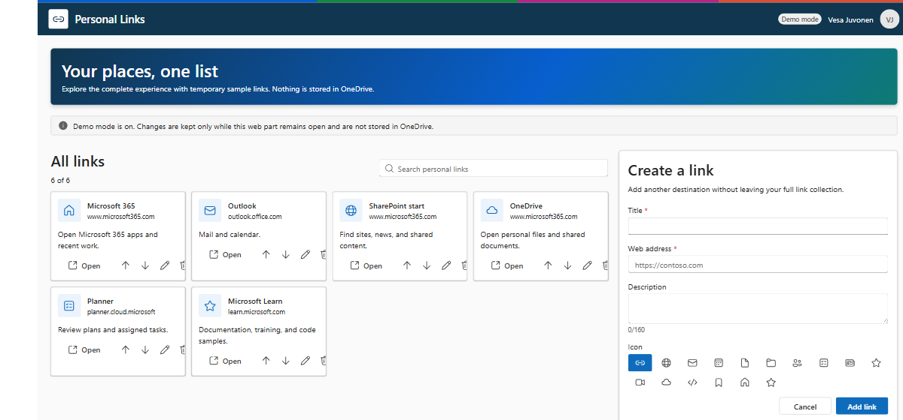
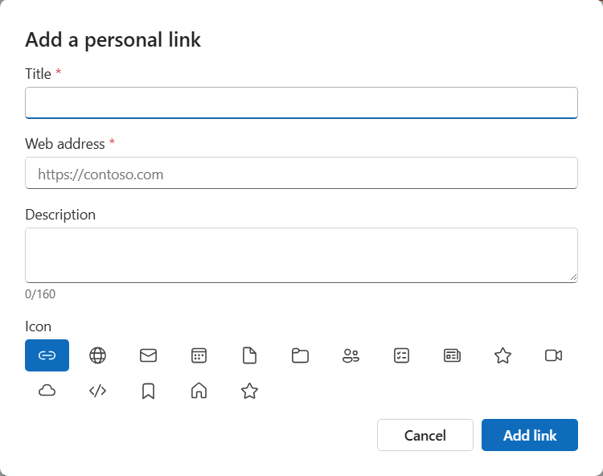

# Personal Links

## Summary

Personal Links demonstrates two patterns together:

1. **One UX in SharePoint and Copilot.** The same React and Fluent UI application runs as a compact
   Copilot inline component, a Copilot full-screen experience, a SharePoint web part, and a SharePoint
   full-page app. A separately packaged Teams personal app hosts the same web part in Full mode.
2. **One personal state across hosts and devices.** The shared application stores the signed-in user's
   link collection in the least-privilege OneDrive App Folder, so the same content follows the user
   between Copilot, SharePoint, Teams, and devices.

The Copilot component and web part are intentionally thin host adapters around that shared application
and storage service. Personal links are stored in `personal-links-v1.json`, and the solution requests
only the delegated Microsoft Graph `Files.ReadWrite.AppFolder` permission.

For a presenter-ready setup, UX walkthrough, failure demonstration, and code tour, see
[`DEMO-SCRIPT.md`](./DEMO-SCRIPT.md).







## Compatibility


Microsoft 365 Copilot compatibility depends on the SPFx 1.24 Copilot Component preview being enabled in
the target tenant.

## Applies to

- [SharePoint Framework](https://learn.microsoft.com/sharepoint/dev/spfx/sharepoint-framework-overview)
- [Microsoft Copilot extensibility](https://learn.microsoft.com/microsoft-365-copilot/extensibility/)
- [Microsoft 365 tenant](https://learn.microsoft.com/sharepoint/dev/spfx/set-up-your-development-environment)
- SharePoint Online
- OneDrive for work or school

> Get your own free development tenant by subscribing to the
> [Microsoft 365 developer program](https://aka.ms/m365/devprogram).

## Contributors

- [Vesa Juvonen](https://github.com/VesaJuvonen)

## Version history

| Version | Date            | Comments |
| ------- | --------------- | -------- |
| 1.0.3   | October 9, 2026 | Added the resolved App Folder action and finalized the agent provider |
| 1.0.2   | October 9, 2026 | Added Compact pagination and configurable SharePoint links per page |
| 1.0.1   | October 9, 2026 | Polished branding, isolated Teams package, demo script, and finalized host behavior |
| 1.0     | October 8, 2026 | Initial release |

## Prerequisites

- Node.js supported by this SPFx release. The primary development range is `>=22.14.0 <23.0.0`; see
  `package.json` for all supported ranges.
- A Microsoft 365 tenant with a SharePoint App Catalog.
- The SPFx 1.24 Copilot Component preview enabled for Copilot use.
- A tenant administrator who can approve the delegated Microsoft Graph
  `Files.ReadWrite.AppFolder` permission.
- A provisioned OneDrive for every user of the sample.

After deploying the solution, approve the pending `Files.ReadWrite.AppFolder` request from the
**API access** page in the SharePoint admin center. If the permission is not approved or the signed-in
user has no provisioned OneDrive, Personal Links displays an explicit error instead of silently storing
data somewhere else.

For a SharePoint-only UX demonstration without API approval or OneDrive writes, web part authors can
enable **Use temporary demo data**. Demo mode is not available to the Copilot component or Teams
personal app; both always use Microsoft Graph and the signed-in user's OneDrive App Folder.

## Minimal path to awesome

- Clone this repository, or
  [download this solution as a .ZIP file](https://pnp.github.io/download-partial/?url=https://github.com/pnp/spfx-copilot-components/tree/main/samples/personal-links)
  and unzip it.
- From your command line, change the current directory to `samples/personal-links`.
- In the command line run:
  - `npm install`
  - `npm run start`
- To create the production package, run:
  - `npm run build`
- Upload `sharepoint/solution/personal-links.sppkg` to the tenant App Catalog and deploy it.
- In the SharePoint admin center, approve the pending Microsoft Graph
  `Files.ReadWrite.AppFolder` API request.
- Add **Personal Links** to a modern SharePoint page or install the generated Personal Links Copilot
  agent through the supported SPFx Copilot deployment flow.
- Optional: upload `teams-app/personalLinks/TeamsSPFxApp.zip` as a custom Teams app after deploying the
  SPPKG. The Teams ZIP references the deployed web part; it does not contain the implementation.

> A ready-to-deploy package is included at
> [`sharepoint/solution/personal-links.sppkg`](./sharepoint/solution/personal-links.sppkg).

## Features

This sample illustrates the following concepts:

- One shared React 18 experience rendered by a Copilot component and a SharePoint web part.
- Compact and full experiences selected from Copilot display mode or SharePoint web part configuration.
- Component-width container queries that adapt the shared Full experience to each host canvas rather
  than assuming the browser viewport width is the available component width.
- Accessible Compact pagination with a configurable SharePoint page size and a six-link Copilot default.
- Fluent UI v9 components and icons with owner-document Griffel style rendering.
- Zava One-inspired product branding adapted to a smaller personal productivity experience.
- Per-user centralized storage through Microsoft Graph OneDrive App Folder.
- Least-privilege delegated `Files.ReadWrite.AppFolder` access.
- Versioned JSON parsing and validation.
- eTag and `If-Match` conflict protection.
- Accessible create, edit, delete, search, open, and Move up/Move down interactions.
- Bounded Copilot model-context updates that exclude URLs, descriptions, hidden records, and drafts.
- One shared SPFx bundle for the common React, Fluent, service, and application graph.
- A deliberate packaging boundary between the Copilot agent ZIP and the separately generated Teams
  personal-app ZIP.
- An explicit web-part demo mode that exercises the complete UX without reading or writing OneDrive.
- Shared custom branding for the agent, web-part toolbox, and Teams app, using the UX accent colors.

### Experiences

#### Compact

Compact mode is optimized for viewing and opening links. It shows one page of icon-forward links,
accessible Previous/Next controls when more links exist, an **Add personal link** action, and
**View in full screen** when the Copilot host supports it. Copilot uses six links per page because agent
components have no author property pane. SharePoint authors can choose 3, 6, 9, or 12 links per Compact
page. Link creation uses the same editor as Full mode in a Fluent dialog. Before the dialog opens, the
Copilot adapter asks the host to expand the inline iframe from its compact height to the editor height.
Closing or saving the dialog restores the compact requested size.

Compact mode is used for:

- Copilot inline rendering; and
- the default SharePoint web part experience.

#### Full

Full mode provides:

- all links in a responsive icon-forward grid;
- search by title, hostname, or description;
- an always-available create/edit inspector on wider screens;
- a curated Fluent icon picker;
- editing and confirmed deletion;
- accessible Move up and Move down ordering; and
- visible loading, saving, permission, stale-data, conflict, and error states.

Full mode is used for:

- Copilot full-screen rendering;
- an author-selected full SharePoint web part; and
- the SharePoint full-page host.

### Branding and visual model

The experience adapts the top-bar model from `samples/zava-one-hub`:

- a segmented blue, green, magenta, and coral accent;
- a shared interlocking-link app mark for Copilot, the SharePoint toolbox, and Teams;
- a dark navy product bar in Full mode;
- a light Personal Links brand tile;
- truthful OneDrive storage status; and
- signed-in user identity.

Compact mode retains only the thin accent and smaller product identity so branding does not consume the
limited inline height. The sample does not copy the Zava workspace tabs, dashboard density, fictional
demo status, personas, or domain imagery.

### Architecture

```text
PersonalLinksCopilotComponent -----+
                                    +--> PersonalLinksApp
PersonalLinksWebPart --------------+      |- Compact experience
                                           |- Full experience
                                           |- Shared editor/icon picker
                                           `- Shared state controller
                                                    |
                                                    v
                                         IPersonalLinksService
                                                    |
                                                    v
                                        GraphPersonalLinksService
                                                    |
                                                    v
                                    OneDrive /special/approot
```

The host adapters are intentionally thin:

- The Copilot adapter owns host-authoritative display-mode requests, link opening through the Copilot
  bridge, and bounded model-context updates.
- The web part adapter owns SharePoint host mode, property-pane configuration, safe browser link opening,
  and SharePoint theme changes.
- Shared React owns all visible UX, drafts, validation, list interactions, and storage commands.
- The Graph service owns App Folder paths, schema parsing, eTags, and Graph error mapping.

This separation is the reusable pattern when one experience must appear in multiple SPFx hosts.

### OneDrive App Folder storage

The solution uses these Microsoft Graph paths:

```text
GET /me/drive/special/approot
GET /me/drive/special/approot:/personal-links-v1.json
GET /me/drive/special/approot:/personal-links-v1.json:/content
PUT /me/drive/special/approot:/personal-links-v1.json:/content
```

The App Folder root response also provides the current user's `webUrl`. The Graph service carries that
resolved URL into the shared application, which exposes **Open App Folder** in Compact and Full
production UX. This opens the actual folder in the user's OneDrive for demonstrations without
hard-coding a tenant domain, personal-site path, or application folder name. The URL is not published to
Copilot model context and is not shown in temporary demo mode.

There is no App Folder or user-data JSON file checked into the solution. Their lifecycle is:

1. On the first production load, `GET /me/drive/special/approot` asks Microsoft Graph for the
   signed-in user's application folder. With permission approved and OneDrive provisioned, Microsoft
   Graph creates the app-specific folder under the user's **Apps** folder if it does not already exist.
   Its visible folder name is determined by the Microsoft 365 application identity and is not guaranteed
   to be **Personal Links**. The application does not construct or assume its physical OneDrive path.
2. The service looks for `personal-links-v1.json` in that folder. A missing file is a valid first-run
   state and is represented in memory as an empty version 1 document; simply viewing an empty experience
   does not create the JSON file.
3. When the user first creates or otherwise saves a link, the application builds the version 1 document,
   serializes it with `JSON.stringify`, and uses the Graph `PUT ...:/content` request. That request
   creates `personal-links-v1.json`. Later saves replace its content using the current eTag for conflict
   protection.
4. Every production host uses this same file. The Copilot component, SharePoint web part, SharePoint
   full-page app, and Teams personal app therefore show the same links for the same signed-in user.

The JSON contract is defined by `IPersonalLinksDocument` and `IPersonalLink` in
`src/shared/models/personalLinks.ts`. A stored document has this shape:

```json
{
  "schemaVersion": 1,
  "links": [
    {
      "id": "link-1728388800000-k3f8x2",
      "title": "Microsoft 365",
      "url": "https://www.microsoft365.com/",
      "description": "Open Microsoft 365",
      "iconKey": "globe",
      "order": 0,
      "createdAt": "2026-10-08T12:00:00.000Z",
      "updatedAt": "2026-10-08T12:00:00.000Z"
    }
  ],
  "updatedAt": "2026-10-08T12:00:00.000Z"
}
```

The version 1 document stores:

- a stable link ID;
- title;
- absolute HTTP or HTTPS URL;
- optional description;
- stable Fluent icon key;
- display order; and
- created and updated timestamps.

Existing files are saved with the current eTag in an `If-Match` header. Microsoft Graph HTTP 412
responses become visible concurrency conflicts instead of silently replacing changes from another host.
Invalid documents and documents created by unsupported future schema versions are not overwritten.

#### Missing permission and OneDrive errors

When Microsoft Graph returns 401 or 403, the experience displays an actionable permission message that
instructs the user to ask a tenant administrator to approve Microsoft Graph
`Files.ReadWrite.AppFolder` under **SharePoint admin center > Advanced > API access**. The message
provides **Setup guidance** and **Retry** actions.

When the App Folder root returns 404, the experience explains that OneDrive is not provisioned and asks
the user to open OneDrive once or contact an administrator. A missing `personal-links-v1.json` file is
handled separately as a valid first-run empty state. Temporary SharePoint demo mode does not call Graph,
create an App Folder, or create `personal-links-v1.json`; its data exists only in memory.

### Web part configuration

The initial web part supports only:

- `SharePointWebPart`; and
- `SharePointFullPage`.

The **Display mode** property provides:

- **Auto** - Compact on a normal SharePoint page and Full through `ComponentHost.aspx`;
- **Compact** - always use the launcher; and
- **Full** - always use the manager.

The **Links per Compact page** property provides 3, 6, 9, or 12 links per page. It defaults to six and
affects only Compact mode. Copilot also uses the shared six-link default but does not expose a property
pane; Teams always uses Full mode.

The **Use temporary demo data** toggle controls storage:

- **Off** - the shared application uses `GraphPersonalLinksService` and stores links in the user's
  OneDrive App Folder.
- **On** - the shared application uses `MemoryPersonalLinksService`, starts with six representative
  links, and makes no App Folder calls.

Demo mode shows a persistent disclosure in both Compact and Full experiences. Create, edit, delete,
search, open, icon selection, and reordering remain functional, but mutations survive only while that
web part instance remains mounted. Refreshing the page or creating a new web part service restores the
seeded demo links.

The Copilot component and Teams personal app have no storage selector. Both always construct or select
`GraphPersonalLinksService`, so every supported host reads and writes the same signed-in user's
`personal-links-v1.json` App Folder file.

### Teams personal app and packaging boundary

The primary web-part manifest does not enable `TeamsPersonalApp` or `TeamsTab`. That deliberate boundary
prevents SPFx from automatically adding a Teams web-part ZIP to the same SPPKG that contains the Copilot
agent package.

The generated `teams/personal-links.zip` file is the Copilot declarative-agent package. It is not a
Teams web-part companion package.

The handcrafted `teams-app/personalLinks/TeamsSPFxApp.zip` follows the isolated
`samples/zava-one-hub/teams/` model. Its personal tab routes directly to the deployed web-part component
through `TeamsLogon.aspx` and `teamshostedapp.aspx`. In Teams, the host adapter selects Full mode and
hides the in-app product bar because Teams already provides app and user chrome.

Regenerate or validate the shared icons and Teams package with:

```powershell
.\teams-app\package-app.ps1
.\teams-app\package-app.ps1 -Check
```

The ZIP contains only `manifest.json`, `color.png`, and `outline.png` at its root. Upload it separately
from the Copilot agent package. The sibling `teams-app` folder is intentionally outside SPFx's reserved
top-level `teams` folder, whose contents are copied into the SPPKG. See
[`teams-app/README.md`](./teams-app/README.md) for installation details.

### Solution structure

```text
config/
  package-solution.json                       # Permission and SPPKG metadata
copilot/                                      # Declarative agent and API plugin source
src/
  copilotComponents/personalLinks/            # Thin Copilot host adapter
  webparts/personalLinks/                     # Generated thin SharePoint host adapter
  shared/
    components/PersonalLinksApp.tsx           # Compact and Full shared UX
    components/PersonalLinksErrorBoundary.tsx # Shared accessible recovery
    components/PersonalLinksThemeProvider.tsx # ownerDocument Fluent/Griffel boundary
    models/personalLinks.ts                    # Versioned model, parsing, validation
    services/IPersonalLinksService.ts          # Swappable storage contract
    services/GraphPersonalLinksService.ts      # Graph App Folder implementation
    services/MemoryPersonalLinksService.ts     # Non-persistent web part demo implementation
assets/sample.json                            # PnP sample gallery metadata
assets/personal-links-webpart.png             # Shared generated web-part artwork
teams-app/package-app.ps1                     # Branding and isolated Teams package generator
teams-app/personalLinks/TeamsSPFxApp.zip       # Ready-to-upload Teams personal app
todo.md                                       # Design, phases, and validation gates
```

### Validation

The production validation command is:

```powershell
npm run build
```

The latest local run completed with:

- TypeScript compilation passed;
- ESLint passed with zero warnings;
- focused model and service Jest tests passed with 0 failures;
- production packaging passed;
- one shared application bundle;
- one current Copilot agent ZIP in the SPPKG; and
- zero `TeamsSPFxApp.zip` entries.

The separate Teams package is validated with:

```powershell
.\teams-app\package-app.ps1 -Check
```

The ready-to-deploy version 1.0.0.3 SPPKG is 158,579 bytes with SHA-256:

```text
4776FDA62E733AC21A11C43949A90BA1DCA07B020587DEDFD23FF2928F38B833
```

The isolated `TeamsSPFxApp.zip` is 15,840 bytes with SHA-256
`A3FE833AC5B7AF7DCC19DFF603A1A00A67A0C22F7B97186CB5D07C6A6FEDC292`.

Authenticated tenant checks remain open for API consent, OneDrive provisioning, Copilot inline and
full-screen behavior, model context, SharePoint full-page routing, accessibility, and screenshots.

### Limitations

- Cross-host changes appear on the next load or explicit Retry. The sample does not implement push
  synchronization.
- The sample does not include folders, tags, link previews, favicons, sharing, import/export, browser
  bookmark synchronization, telemetry, or organizational link administration.
- Reordering uses keyboard-accessible Move up and Move down controls rather than drag and drop.
- Teams installation still requires custom-app upload to be allowed by tenant policy and must be
  validated against the deployed SPFx solution in an authenticated tenant.
- Gallery screenshots remain pending authenticated tenant validation.

### References

- [Using app folder in OneDrive and SharePoint](https://learn.microsoft.com/graph/onedrive-sharepoint-appfolder)
- [Use Microsoft Graph in SPFx](https://learn.microsoft.com/sharepoint/dev/spfx/use-aadhttpclient)
- [SharePoint Framework overview](https://learn.microsoft.com/sharepoint/dev/spfx/sharepoint-framework-overview)
- [Build Microsoft 365 Copilot extensibility](https://learn.microsoft.com/microsoft-365-copilot/extensibility/)
- [SPFx deployment guidance for Teams solutions](https://learn.microsoft.com/sharepoint/dev/spfx/deployment-spfx-teams-solutions)
- [Teams app package and icon requirements](https://learn.microsoft.com/microsoftteams/platform/concepts/build-and-test/apps-package)

## Help

We do not support samples, but this community is always willing to help, and we want to improve these
samples. We use GitHub to track issues, which makes it easy for community members to volunteer their
time and help resolve issues.

You can try looking at
[issues related to this sample](https://github.com/pnp/spfx-copilot-components/issues) to see if anybody
else has the same issue.

If you encounter an issue, [create a new issue](https://github.com/pnp/spfx-copilot-components/issues/new).

## Disclaimer

**THIS CODE IS PROVIDED _AS IS_ WITHOUT WARRANTY OF ANY KIND, EITHER EXPRESS OR IMPLIED, INCLUDING ANY
IMPLIED WARRANTIES OF FITNESS FOR A PARTICULAR PURPOSE, MERCHANTABILITY, OR NON-INFRINGEMENT.**


