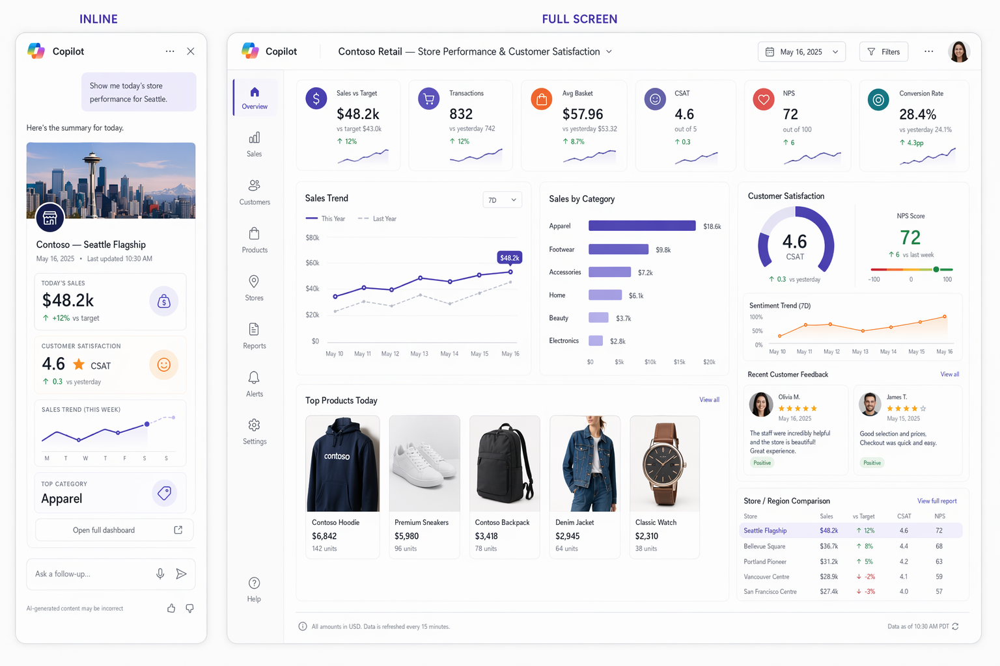
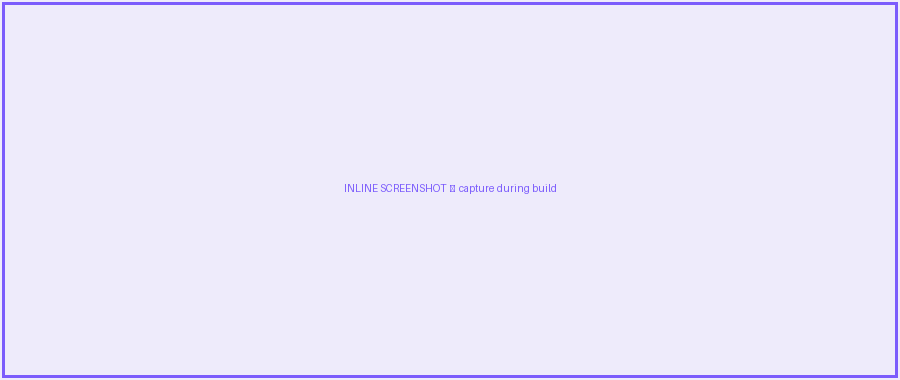

# Contoso Retail — Store Performance & Customer Satisfaction

> The store at a glance — sales, satisfaction and top products — reimagined for the Copilot canvas.

`Flagship · Retail / Corporate Sales`

    

## Summary

A retail manager opens Copilot and asks *"how is my store doing?"* — and instead of a paragraph, Copilot renders a beautiful, branded **store dashboard**: today's sales versus target, customer satisfaction, top products, and category performance. Expanded, it becomes a full retail-analytics workspace that pairs **sales performance** with **customer satisfaction** (CSAT, NPS, sentiment and live reviews) in one polished surface.

This is a **SharePoint Copilot App** built as an SPFx 1.24 **Copilot Component** (`RetailStoreDashboard`). The same React component renders in two modes inside the Copilot canvas — a compact **inline** card and an immersive **full-screen** experience — and can also be surfaced as a classic web part or Viva Connections card.

> ✨ **A modernization of the classic [PnP `contoso-retail-demo`](https://github.com/pnp/spfx-reference-scenarios/tree/main/samples/contoso-retail-demo)** (Paolo Pialorsi's *react-retail-dashboard*). That sample proved an end-to-end retail dashboard across Teams, Outlook, the M365 app portal and a Viva Connections ACE, backed by an Azure Function API. This sample reimagines that retail experience as a **Copilot-canvas app** with a refreshed, modern Fluent UI v9 design and a customer-satisfaction story at its heart.

## Concept mockup



*Inline (left) + full-screen (right). Replace with real screenshots once the component is built.*

## Screenshots & demo

> 🖼️ **Image placeholders** — replace the files in `./assets/` with real captures during the build.

| Inline | Full screen |
| --- | --- |
|  |  |


## Business value

The retail demo is one of the most-shown SPFx reference scenarios — but its UX is now several years old. Modernizing it as a **Copilot App** gives ISVs and retail customers a *current*, visually stunning starting point that fuses the two questions every store leader asks — **"are we hitting our numbers?"** and **"are our customers happy?"** — into a single engaging surface. Uses mocked data so anyone can deploy and demo in minutes — no LOB integration required.

## What's modernized (old → new)

| Classic `contoso-retail-demo` | This Copilot App |
| --- | --- |
| Teams personal app + Outlook + M365 app + Viva ACE | **Rendered directly in the Copilot canvas** (inline + full-screen), still reusable as a web part / Viva card |
| Azure Function REST back-end | **Swappable data service** over SharePoint lists / Microsoft Graph with a `useMock` flag — zero back-end to run |
| Sales-centric dashboard | **Sales *and* customer satisfaction** — CSAT, NPS, sentiment trend and live review cards as first-class UX |
| Classic React UI | **Fluent UI v9**, dark/light aware, responsive, accessible, with charts, gauges, and a product gallery |
| Static screens | **Conversational entry** — "how's my store?", "show customer feedback", "which products are trending?" |

## UX components

Store summary card · KPI band · sales-vs-target trend · category bars · **CSAT ring gauge** · **NPS score** · sentiment trend · **customer review cards (star ratings)** · top-products gallery · store/region comparison

## Data source

SharePoint lists **`Stores`** (`Store, Region, Manager, Target`), **`Sales`** (`Store, Date, Category, Amount, Transactions, Basket`), **`Products`** (`SKU, Name, Category, Image, UnitsSold, Revenue`), and **`CustomerFeedback`** (`Store, Date, CSAT, NPS, Sentiment, Comment, Reviewer`). Microsoft Graph for the signed-in manager's store. Mock fallback in `/sampledata`.

> All data is **mocked** for the sample. A swappable data service exposes a `useMock` flag — `true` for offline demos, `false` to read the live SharePoint lists / Microsoft Graph.

## Inline experience

A **store summary card** — store name, today's sales with a vs-target delta, a **CSAT star rating**, a weekly sales sparkline, and the top category — a "store at a glance" that fits in two rows of the chat.

## Full-screen experience

A premium retail-analytics workspace:

- **KPI band** — Sales vs Target, Transactions, Avg Basket, CSAT, NPS, Conversion
- **Sales performance** — a trend line vs last year and a sales-by-category bar chart
- **Customer satisfaction** — a CSAT ring gauge, an NPS score, a sentiment trend, and live **customer review cards** with star ratings and themes
- **Top products** — an image gallery with units sold and revenue
- **Store / region comparison** — rank this store against the network, with a period and store selector

## Wireframe

```text
INLINE  🏬 Contoso · Seattle Flagship   💰 $48.2k ▲12% vs target   ★ 4.6 CSAT   ▁▂▄▆█   Top: Apparel

FULL    ┌ KPI band: Sales | Transactions | Avg basket | CSAT | NPS | Conversion ┐
        │  Sales trend (vs last year)        │  Sales by category (bars)        │
        │  Customer satisfaction:  ◔ CSAT 4.6 · NPS 62 · sentiment ▁▂▄▆ · ★ reviews │
        │  Top products (image gallery + units/revenue)   │  Store vs region rank │
        └ store selector ▾   ·   period ▾ ──────────────────────────────────────┘
```

## Build it with GitHub Copilot

Paste these prompts into **GitHub Copilot Chat** with the SPFx 1.24 Copilot Component scaffold open. Assumes React + TypeScript, Fluent UI v9, theme-aware (dark/light from the canvas), charts via Recharts/Fluent Charts, and a swappable data service.

### Inline prompt

```text
Create an SPFx 1.24 Copilot Component in React + TypeScript named RetailStoreDashboard, inline mode, using Fluent UI v9. Render a store summary card for the signed-in manager's store: store name and location, today's sales with a percentage delta vs target (up/down arrow, color-coded), a customer-satisfaction star rating (CSAT, 0–5), a weekly sales sparkline, and the top-selling category. Pull data from a RetailService over SharePoint lists Stores/Sales/CustomerFeedback (with Microsoft Graph to resolve the user's store) and a mock JSON fallback. Theme-aware via the canvas theme, responsive down to 320px, fully accessible. Use a premium retail look — deep indigo with coral/amber accents.
```

### Full-screen prompt

```text
Add a full-screen mode to RetailStoreDashboard. Layout: a top KPI band (Sales vs Target, Transactions, Avg Basket, CSAT, NPS, Conversion); a sales-performance row with a Recharts line chart (sales vs last year) and a sales-by-category bar chart; a customer-satisfaction panel with a CSAT ring gauge, an NPS score, a sentiment trend line, and a list of customer review cards (star rating, comment, theme); a top-products image gallery (thumbnail, units sold, revenue); and a store/region comparison with a store selector and period filter. Reuse RetailService; animate chart and gallery entry; keep the premium retail design language; full keyboard and screen-reader support; mock fallback.
```

## Run & deploy

```bash
# 1. Scaffold (choose the "Copilot Component" type)
yo @microsoft/sharepoint

# 2. Provision the mock data lists from /sampledata (PnP template)
#    — or keep useMock = true for a fully offline demo

# 3. Develop & preview in the Copilot Component Workbench
gulp serve

# 4. Package and deploy to the tenant App Catalog
gulp bundle --ship && gulp package-solution --ship
```

Then invoke the agent in Copilot and confirm the inline render, expand-to-full-screen, the customer-satisfaction panel, and dark/light theming.

## Applies to

- [SharePoint Framework 1.24+](https://aka.ms/spfx) (Copilot Component)
- Microsoft 365 Copilot
- Microsoft 365 tenant with the SharePoint App Catalog

## Prerequisites

- Node.js 18.x, gulp-cli, Yeoman + `@microsoft/generator-sharepoint`
- A Microsoft 365 tenant with SPFx 1.24 (public preview) enabled

## Credits & inspiration

Modernized from the **[PnP `contoso-retail-demo`](https://github.com/pnp/spfx-reference-scenarios/tree/main/samples/contoso-retail-demo)** reference scenario (*react-retail-dashboard* by Paolo Pialorsi — PiaSys.com). This sample re-imagines that retail experience for the Copilot canvas with a modern Fluent UI v9 design and an added customer-satisfaction story. All figures here are illustrative mock data.

---

*Part of the **SharePoint Copilot Apps** sample gallery — complex UX in the Copilot canvas, powered by SPFx. See [aka.ms/spfx](https://aka.ms/spfx).*
