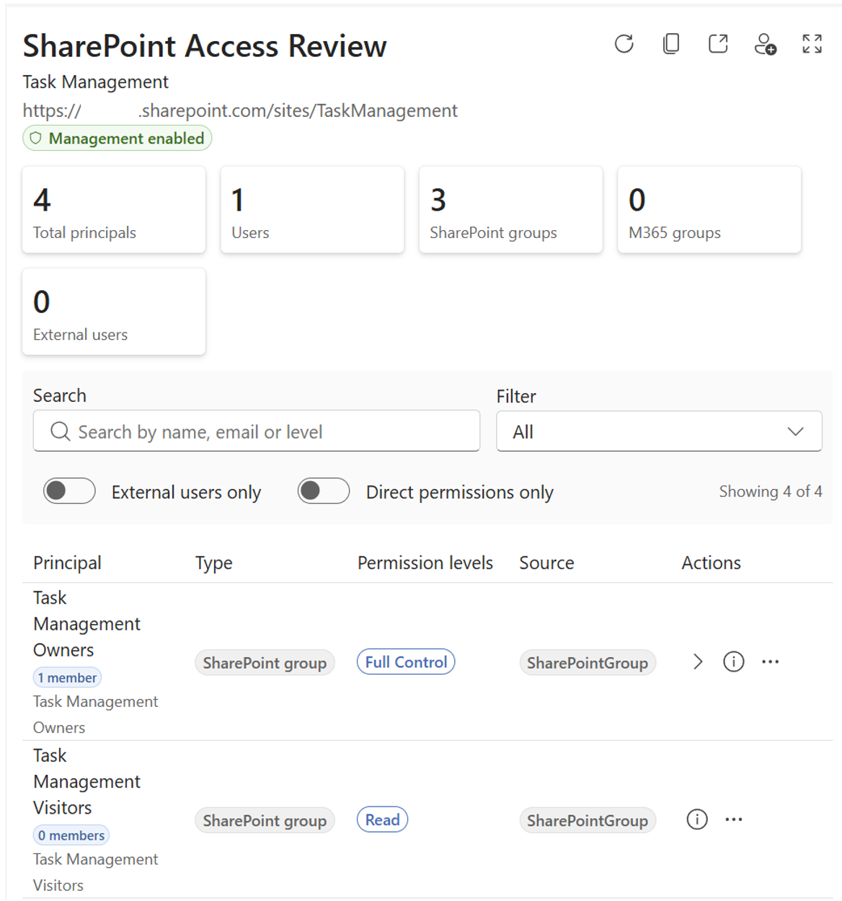
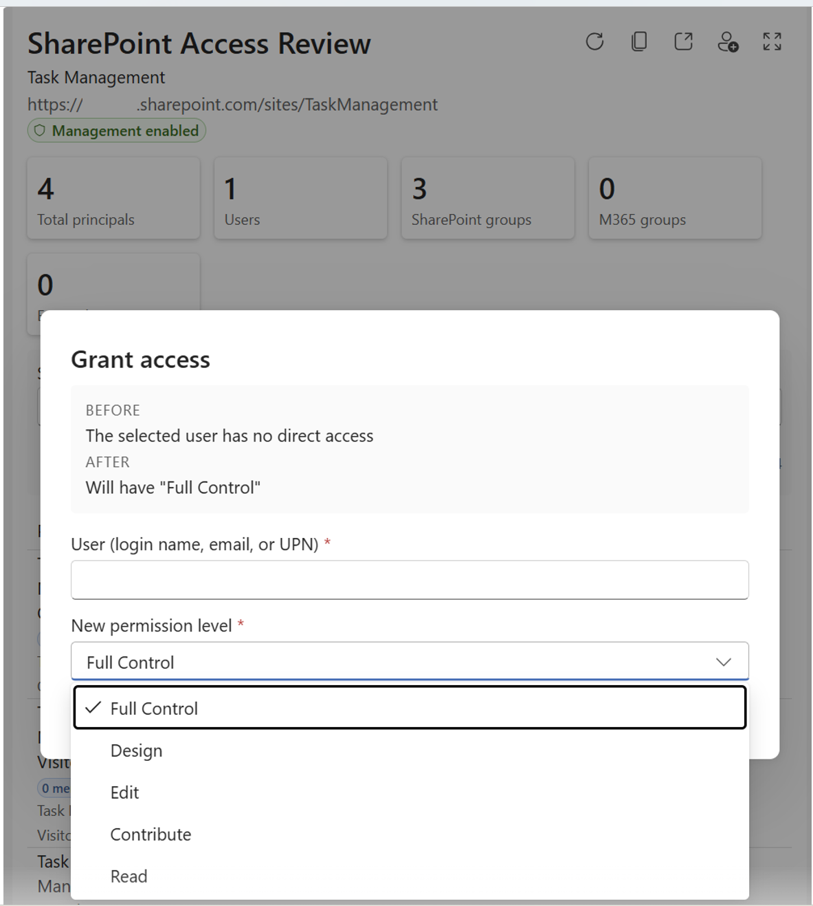

# SP Permissions Explorer - SharePoint Access Review Copilot App

    

## Summary

**SP Permissions Explorer** is a **SharePoint Copilot App** built as an SPFx 1.24 **Copilot Component** (not a classic web part). It lets the signed-in user ask Microsoft 365 Copilot _"who has access to this site?"_ and get back an interactive, on-canvas permissions experience - users, groups, external/guest users and permission levels - instead of a wall of text.

The component queries SharePoint directly with the **user's own delegated identity**, so it only ever surfaces what the user is already allowed to see. From the same experience the user can review access in depth, look up whether a specific person or group has access, and perform **write operations** (grant/remove access, change permission level, add/remove from a SharePoint group) - every write is confirmed in the UI before it runs.

The same React component renders in two modes inside the Copilot canvas:

- a compact **inline** access summary, and
- an immersive **full-screen** permissions explorer with filtering, a full permissions table and a principal details panel.






## Used SharePoint Framework Version


## Applies to

- [SharePoint Framework](https://aka.ms/spfx) 1.24+ (Copilot Component)
- [Microsoft 365 Copilot](https://www.microsoft.com/microsoft-365/copilot)
- [Microsoft 365 tenant](https://docs.microsoft.com/sharepoint/dev/spfx/set-up-your-developer-tenant) with the SharePoint App Catalog

> Get your own free development tenant by subscribing to the [Microsoft 365 developer program](http://aka.ms/o365devprogram)

## Prerequisites

- Node.js >=22.14.0 <23.0.0
- A Microsoft 365 tenant with SPFx 1.24 (dev preview) enabled
- SharePoint App Catalog site
- [Heft](https://heft.rushstack.io/) (`npm install -g @rushstack/heft`)
- Yeoman + `@microsoft/generator-sharepoint` (only needed to scaffold additional components)
- Sufficient SharePoint permissions on the sites you review - the component acts as **the signed-in user**, so read and write operations are subject to that user's own access.

> This solution uses the **Heft** build system (not Gulp) and **React 17** functional components, aligned with the SPFx 1.24 dev preview.

## Solution

| Solution                | Author(s)                                         |
| ----------------------- | ------------------------------------------------- |
| sp-permissions-explorer | [Aimery Thomas](https://github.com/a1mery) |

## Version history

| Version | Date          | Comments        |
| ------- | ------------- | --------------- |
| 1.0     | July 14, 2026 | Initial version |


---

## Minimal Path to Awesome

- Clone this repository
- Ensure that you are at the solution folder (`samples/sp-permissions-explorer`)
- In the command-line run:
  - `npm install -g @rushstack/heft`
  - `npm install`
  - `heft start --clean` - local dev server at `https://localhost:4321`
- Invoke the agent in Microsoft 365 Copilot, name a site you have access to, and confirm the inline access summary renders, expands to full screen, filters correctly, resolves a specific person or group, and prompts for confirmation before any write action.

Production build, test, and package:

```bash
heft test --clean --production && heft package-solution --production
```

Other build commands can be listed using `heft --help`.

## Demo script

1. **Invoke it** - in Microsoft 365 Copilot, select the **Permissions Explorer Agent** agent and ask: _"Who has access to the Home site?"_ The **inline access summary** renders.
2. **Read the summary** - call out the high-level counts (users, groups, external/guest users, permission levels) drawn live from SharePoint with the signed-in user's identity.
3. **Expand** - open the **full-screen** explorer to show the full permissions table, then apply a **filter** (e.g. _External users_ or _Full control_) and watch the table re-scope.
4. **Look someone up** - ask _"Does Adele Vance have access?"_ to switch to **userLookup** mode and open the **principal details panel** with their effective access and how it's granted.
5. **Guarded write** - ask to _grant someone Edit permission_. The component presents an **in-UI confirmation dialog** - nothing changes until the user explicitly confirms.

> The agent prefers rendering the experience over describing permissions in text, and never invents site names, people or access details - the rendered component reports the real data.

## Features

SP Permissions Explorer demonstrates how to build a data-driven, delegated-identity admin experience inside the Microsoft 365 Copilot canvas using an SPFx Copilot Component.

This sample illustrates the following concepts:

- **Copilot Component UX** - a `CopilotComponent` (`copilotType: "Ux"`) surfaced as a tool a declarative agent can call, rendering its own React UI inside the Copilot host.
- **Display-mode-aware rendering** - a single root React component selects a compact **inline** or immersive **full-screen** view from the host-advertised display mode.
- **Delegated-identity SharePoint queries** - permissions are read directly from SharePoint with the signed-in user's own identity via SPFx HTTP clients, so users only see what they're entitled to.
- **Structured tool arguments** - a Zod schema (`siteQuery`, `mode`, `filter`, `principalQuery`, `operation`, …) exported as JSON Schema describes exactly how Copilot invokes the component.
- **Filtering** - narrow the view to users, groups, external/guest users, a permission level (full control / edit / read) or direct-only assignments.
- **Guarded write operations** - grant/remove access, change a permission level, and add/remove principals from SharePoint groups, each gated behind an explicit **in-UI confirmation** before execution.
- **Theme awareness** - light/dark theming driven by the Copilot host context using Fluent UI tokens (no hardcoded colors).

## References

- [Getting started with SharePoint Framework](https://docs.microsoft.com/sharepoint/dev/spfx/set-up-your-developer-tenant)
- [Introducing SharePoint Copilot Apps](https://devblogs.microsoft.com/microsoft365dev/going-beyond-text-in-microsoft-365-copilot-introducing-sharepoint-copilot-apps/)
- [Overview of SharePoint Copilot Apps](https://learn.microsoft.com/en-us/sharepoint/dev/spfx/copilot/overview-copilot-apps)
- [SharePoint REST API](https://learn.microsoft.com/sharepoint/dev/sp-add-ins/get-to-know-the-sharepoint-rest-service)
- [Heft Documentation](https://heft.rushstack.io/)
- [Microsoft 365 & Power Platform Community](https://aka.ms/community/home) - Guidance, tooling, samples and open-source controls for your Copilot, Microsoft 365 & Power Platform development


## Help

If you encounter any issues using this solution, please open an issue in this repository.

## Disclaimer

**THIS CODE IS PROVIDED _AS IS_ WITHOUT WARRANTY OF ANY KIND, EITHER EXPRESS OR IMPLIED, INCLUDING ANY IMPLIED WARRANTIES OF FITNESS FOR A PARTICULAR PURPOSE, MERCHANTABILITY, OR NON-INFRINGEMENT.**


---

