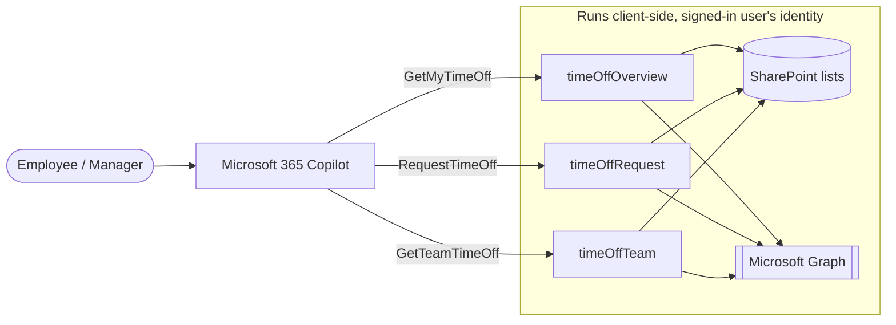

# My Time Off — Time-Off & Absence Copilot App

    

## Summary

**My Time Off** is a **SharePoint Copilot App** built as an SPFx 1.23 **Copilot Components** sample (not a classic web part). It brings an employee's time-off (PTO) experience _inside_ Microsoft 365 Copilot: instead of answering with plain text, Copilot renders three interactive SharePoint components — a personal **overview**, a **request** experience, and a **team** view with manager approvals — directly in the chat canvas.

The point of the sample is to show what makes SPFx Copilot Components different from a generic "MCP app": **authenticated, delegated client-side API calls.** Every component reads and writes its data with the _signed-in user's own identity_, calling **SharePoint REST** and **Microsoft Graph** directly from the browser — no MCP server, no middle tier, no app-only secrets.

> Copilot Components are MCP apps that run as SharePoint Framework code. Because they execute in the SharePoint page context, they can make the same delegated API calls any SPFx web part can — something the MCP app specification itself does not provide. This sample is built to highlight exactly that capability.


_Inline balance card (left) + full-screen team absence calendar with profile photos, balance breakdown and an embedded request panel (right)._

## The three components

| # | Component | Copilot tool | What it renders | APIs used |
|---|-----------|--------------|-----------------|-----------|
| A | `timeOffOverview` | `GetMyTimeOff` | The signed-in user's remaining vacation / sick / personal balances, upcoming booked leave, a recent request history, and (full-screen) an off-work calendar. Optional `leaveType` highlights one balance. | SharePoint REST (`LeaveBalances`, `TimeOffRequests`, `CompanyHolidays`) + Microsoft Graph (`/me/manager`) |
| B | `timeOffRequest` | `RequestTimeOff` | A request form that checks the user's Outlook calendar for conflicts, then writes a new `Pending` request routed to the submitter's manager. | Microsoft Graph (`/me/calendarView`) + SharePoint REST write |
| C | `timeOffTeam` | `GetTeamTimeOff` | Who's out across the team, an inline approvals inbox where managers approve/decline pending requests, an embedded **Request time off** form, and a **full-screen team absence calendar** (member rows × day columns) built from the user's peers + manager (and direct reports, if the user is a manager), each fronted by their Microsoft 365 profile photo. | SharePoint REST (`TimeOffRequests`) + Microsoft Graph (`/me/manager`, `/me/directReports`, `/users/{id}/photo`) |

All three are wired into a single declarative agent, **"My Time Off"**, via [`copilot/declarativeAgent.json`](./copilot/declarativeAgent.json).

## Architecture



Each component follows the same shape:

- **`ui/`** — the Fluent UI v9 React component rendered in the Copilot canvas.
- **`data/`** — a live service (`SharePoint…DataService.ts`) that calls SharePoint REST / Graph with the delegated token and **never throws** — it falls back to an in-memory data set so the component always renders, online or offline.
- **`logic/`** — pure, unit-tested derivation helpers (balances, working-day math, conflict detection, calendar layout) with no I/O.
- **`*Properties.ts`** — the Zod schema describing the tool's arguments to Copilot.

The Fluent v9 styling shell injects theme tokens twice — through `FluentProvider` and as inline CSS variables — and points `createDOMRenderer` / `FluentProvider` at the iframe's `ownerDocument`, so components are correctly themed inside Copilot's sandboxed iframe.

## Used SharePoint Framework Version


## Applies to

- [SharePoint Framework](https://aka.ms/spfx) (Copilot Component)
- [Microsoft 365 Copilot](https://www.microsoft.com/microsoft-365/copilot)
- [Microsoft 365 tenant](https://docs.microsoft.com/sharepoint/dev/spfx/set-up-your-developer-tenant) with the SharePoint App Catalog

> Get your own free development tenant by subscribing to the [Microsoft 365 developer program](http://aka.ms/o365devprogram)

## Prerequisites

- Node.js >=22.14.0 <23.0.0
- A Microsoft 365 tenant with **SharePoint** and **Microsoft 365 Copilot** enabled
- A **SharePoint App Catalog** (tenant or site collection) and rights to deploy to it
- Rights to **approve API permissions** in the SharePoint admin center (for the Microsoft Graph scopes)
- [Heft](https://heft.rushstack.io/) (`npm install -g @rushstack/heft`)
- [PnP.PowerShell](https://pnp.github.io/powershell/) to provision the SharePoint lists (see [`scripts/README.md`](./scripts/README.md))

> This solution uses the **Heft** build system (not Gulp) and **React 17** functional components, aligned with the SPFx 1.23 dev preview.

## Solution

| Solution         | Author(s)                                                                 |
| ---------------- | ------------------------------------------------------------------------- |
| time-off-absence | Bert Jansen (Microsoft) &#124; [GitHub](https://github.com/jansenbe)      |

## Version history

| Version | Date          | Comments |
|---------|---------------|----------|
| 1.0     | July 6, 2026 | Initial release |

## Disclaimer

**THIS CODE IS PROVIDED _AS IS_ WITHOUT WARRANTY OF ANY KIND, EITHER EXPRESS OR IMPLIED, INCLUDING ANY IMPLIED WARRANTIES OF FITNESS FOR A PARTICULAR PURPOSE, MERCHANTABILITY, OR NON-INFRINGEMENT.**

---

## Minimal Path to Awesome

> **Ready-made package included.** The repository ships the fully built solution package at [sharepoint/solution/time-off.sppkg](./sharepoint/solution/time-off.sppkg), so you don't have to build from source to deploy it. Unlike a pure mock sample, this one reads and writes **real SharePoint lists** and calls **Microsoft Graph**, so you still need to (1) provision the three lists, (2) point the components at that lists site, and (3) approve the Graph permissions. Prefer to build from source instead? Do steps 2–4 below; otherwise skip straight to provisioning and deployment.

- Clone this repository
- Ensure that you are in the solution folder (`samples/time-off-absence`)
- In the command line run:
  - `npm install`

### 1. Optionally provision the SharePoint lists (PnP PowerShell)

The components read and write three lists. The full column contract and all script options are in [`scripts/README.md`](./scripts/README.md). The script is idempotent — safe to re-run.

```powershell
cd scripts
.\Provision-TimeOffLists.ps1 `
    -SiteUrl        https://contoso.sharepoint.com/sites/hr `
    -ClientId       00000000-0000-0000-0000-000000000000 `
    -SeedSampleData `
    -EmployeeUpn    megan@contoso.com `
    -ApproverUpn    adele@contoso.com `
    -TeamMemberUpns alex@contoso.com,jordan@contoso.com,taylor@contoso.com
```

`-ClientId` is an Entra ID app registration used for the interactive PnP sign-in (create one once with `Register-PnPEntraIDAppForInteractiveLogin`). Run the script signed in as the **manager** who should see the pending approvals.

> The `-ApproverUpn` only seeds the sample rows. **Live** requests created through the components ignore it and route to the submitter's manager resolved from Graph (`/me/manager`), falling back to self-approval when no manager is found — which keeps a single-user demo tenant fully functional.

### 2. Optionally Point the components at your lists site

Open [`src/copilotComponents/shared/listsSiteConfig.ts`](./src/copilotComponents/shared/listsSiteConfig.ts) and set `TIME_OFF_LISTS_SITE_PATH` to the **server-relative path** of the site you provisioned (the path part of its `-SiteUrl`):

```ts
export const TIME_OFF_LISTS_SITE_PATH = '/sites/spfx';
```

The **host** is taken automatically from the SPFx page context at runtime, so only the site path is configured here — the components follow whichever tenant they run in.

**Why this is required:** the components read their data with delegated, client-side SharePoint REST calls. Inside Microsoft 365 Copilot / BizChat there is no current SharePoint page, so the host resolves the "current web" to the tenant **root** site — where the lists don't exist. Every REST call then 404s and the component silently falls back to demo data. Pinning the site path (while taking the host from context) fixes this. (Leave it `''` only if the components run on a page that already lives on the lists' own site.)

**Runtime override (no rebuild) — the `TimeOffSite` tenant property.** `TIME_OFF_LISTS_SITE_PATH` is only the compiled-in _default_. At runtime each component reads a SharePoint **tenant property** named `TimeOffSite` (an app-catalog storage entity) with a delegated, client-side call — `GET {web}/_api/web/GetStorageEntity('TimeOffSite')`, which resolves from any site in the tenant, including the Copilot root web. When that property is present and non-empty its value **wins** over the constant. This lets an admin repoint every component at a different lists site **without rebuilding or redeploying** the package. Publish it with the provisioning script's `-SetTenantProperty` switch:

```powershell
.\Provision-TimeOffLists.ps1 `
    -SiteUrl  https://contoso.sharepoint.com/sites/hr `
    -ClientId 00000000-0000-0000-0000-000000000000 `
    -SetTenantProperty
```

…or set it directly: `Set-PnPStorageEntity -Key TimeOffSite -Value /sites/hr`. Setting a tenant property requires ownership of the **tenant app catalog** (or a SharePoint / Global admin); if the account lacks that, the script skips it with a warning and list provisioning still succeeds. See [`scripts/README.md`](./scripts/README.md) for the one-time property-bag unblock steps.

### 3. Build the package (only if building from source)

```powershell
heft test --clean --production && heft package-solution --production
```

This produces:

- `sharepoint/solution/time-off.sppkg` — the SharePoint package.
- `teams/my-time-off.zip` — the Copilot/Teams agent package.

Other build commands can be listed using `heft --help`.

### 4. Deploy & approve Microsoft Graph permissions

- Upload `sharepoint/solution/time-off.sppkg` to your **App Catalog** and deploy it (enable it in all sites so the Copilot Components are registered) + choose 'Add to Teams' to deploy the Agent to the Microsoft 365 Agent store

### 5. Make the components available to Copilot

- Adding the app to a site (previous step) registers the Copilot Components

### 6. Try it in Copilot

Open Microsoft 365 Copilot, pick the **My Time Off** agent (or invoke the tools from your own agent), and use the prompts below.

## Sample Copilot prompts

**Overview (Component A)**

- "How many vacation days do I have left?"
- "Show my upcoming time off."
- "What time-off requests have I made recently?"

**Request (Component B)**

- "Book vacation from July 6 to July 10."
- "Request a sick day for tomorrow."
- "I want to take next Friday off as a personal day."

**Team & approvals (Component C)**

- "Who's out of office this week?"
- "Show my team's time off." _(expand for the full-screen team absence calendar)_
- "Show the time-off requests waiting for my approval." _(manager)_
- "I need to book some time off." _(opens the embedded request form)_

## Features

My Time Off demonstrates how to build a rich, theme-aware, **data-connected** UX inside the Microsoft 365 Copilot canvas using SPFx Copilot Components.

This sample illustrates the following concepts:

- **Delegated client-side API calls from a Copilot Component** — SharePoint REST (`/_api/web/lists`) and Microsoft Graph (`/me/calendarView`, `/me/manager`, `/users/{id}/photo`) called with the signed-in user's token, no backend. This is the headline capability the MCP app spec itself does not provide.
- **One tool per component** — each component exposes a single, well-described Copilot tool, so the model has an unambiguous reason to invoke it.
- **Rich, themed UI in the Copilot canvas** — Fluent UI v9 rendered inside Copilot's sandboxed React-17 iframe, with theme tokens injected so the components match the host theme.
- **Resilient live data services** — each service calls SharePoint / Graph live but never throws: on any failure it falls back to a built-in in-memory data set so the demo always renders.
- **Write-back with a Graph pre-check** — the request component checks the user's Outlook calendar for conflicts (Microsoft Graph) before a new request is written to SharePoint.
- **Manager-as-approver, resolved client-side** — a new request is routed to the submitter's line manager, looked up live via Microsoft Graph (`/me/manager`) and converted to a site user via `/_api/web/ensureuser`, with a **self-approval fallback** that keeps single-user demo tenants working.
- **Display-mode-aware rendering** — inline cards expand to full-screen experiences (the overview's off-work calendar, the team's Gantt-style absence calendar) via `requestDisplayModeAsync('fullscreen')`.
- **People & photos from Graph** — team members are fronted by their Microsoft 365 profile photo, fetched client-side as a 48×48 data URL, with an initials fallback.

## Data source

The components read and write **three SharePoint lists** and call **Microsoft Graph** live. The full list column contract is documented in [`scripts/README.md`](./scripts/README.md); provision the lists with the included [`scripts/Provision-TimeOffLists.ps1`](./scripts/Provision-TimeOffLists.ps1).

### SharePoint lists

| List | Holds | Key columns |
|------|-------|-------------|
| `TimeOffRequests` | Individual leave requests. | `Title` (request key), `Employee`, `LeaveType`, `StartDate`, `EndDate`, `WorkingDays`, `Status`, `Note`, `Approver`, `SubmittedOn` |
| `LeaveBalances` | Per-employee, per-leave-type, per-year entitlement. Used / pending days are **derived on the fly** from `TimeOffRequests`, not stored. | `Title` (key), `Employee`, `LeaveType`, `EntitledDays`, `Year` |
| `CompanyHolidays` | Public/company holidays by region (excluded from working-day math). | `Title` (holiday), `HolidayDate`, `Region` |

> `HolidayDate` is used instead of `Date` because `Date` is a reserved internal field name in SharePoint.

## Solution structure

```text
samples/time-off-absence/
  README.md
  assets/                         # concept mockup + gallery preview
  config/                         # Heft / SPFx + Copilot agent configuration
  copilot/                        # declarative agent + plugin manifests (declarativeAgent.json, ai-plugin.json, manifest.json, icons)
  scripts/                        # Provision-TimeOffLists.ps1 + scripts/README.md
  sharepoint/solution/time-off.sppkg   # ready-made package
  teams/my-time-off.zip           # Copilot / Teams agent package
  src/
    copilotComponents/
      shared/
        listsSiteConfig.ts        # TIME_OFF_LISTS_SITE_PATH + TimeOffSite runtime override
      timeOffOverview/            # Component A — GetMyTimeOff
        TimeOffOverviewCopilotComponent.tsx
        TimeOffOverviewCopilotComponent.manifest.json
        data/                     # SharePoint + Graph data service (never throws)
        logic/                    # balances, working-day math (pure, unit-tested)
        ui/                       # Fluent v9 inline + full-screen views
      timeOffRequest/             # Component B — RequestTimeOff
        TimeOffRequestCopilotComponent.tsx
        TimeOffRequestCopilotComponent.manifest.json
        logic/                    # calendar conflict detection
        ui/                       # request form
      timeOffTeam/                # Component C — GetTeamTimeOff
        TimeOffTeamCopilotComponent.tsx
        TimeOffTeamCopilotComponent.manifest.json
        data/                     # roster + photos (Graph) + requests (SharePoint)
        logic/                    # team calendar layout
        ui/                       # who's-out list, approvals inbox, absence calendar
```

## References

- [Overview of Copilot Components / declarative agents](https://learn.microsoft.com/microsoft-365-copilot/extensibility/)
- [Getting started with SharePoint Framework](https://docs.microsoft.com/sharepoint/dev/spfx/set-up-your-developer-tenant)
- [Use Microsoft Graph in your SPFx solution](https://docs.microsoft.com/sharepoint/dev/spfx/web-parts/get-started/using-microsoft-graph-apis)
- [Heft Documentation](https://heft.rushstack.io/)
- [PnP PowerShell](https://pnp.github.io/powershell/)
- [Microsoft 365 & Power Platform Community](https://aka.ms/community/home) - Guidance, tooling, samples and open-source controls for your Copilot, Microsoft 365 & Power Platform development

---

> Notice that better pictures and documentation will increase the sample usage and the value you are providing for others. Thanks for your submissions in advance.

> Share your solution with others through the Microsoft 365 Patterns and Practices program to get visibility and exposure. More details on the community, open-source projects and other activities from http://aka.ms/community/home.

_Part of the **SharePoint Copilot Apps** sample gallery - complex UX in the Copilot canvas, powered by SPFx. See [aka.ms/spfx](https://aka.ms/spfx)._


