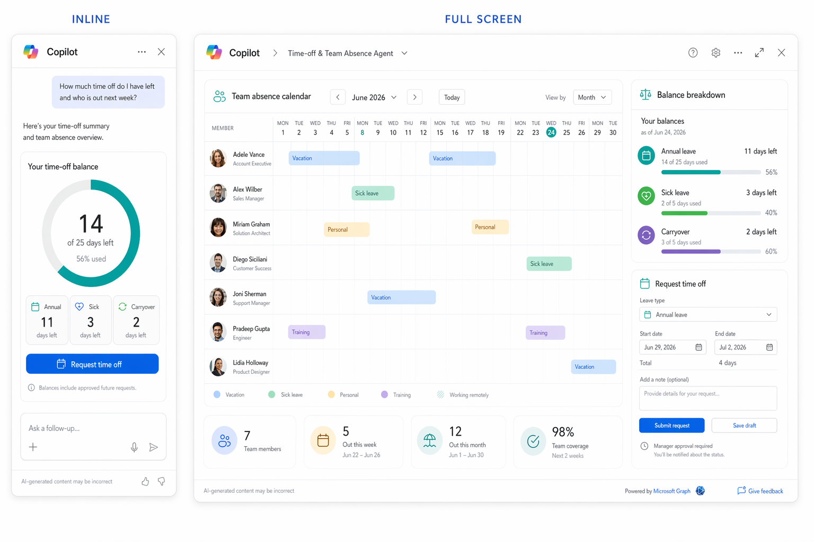
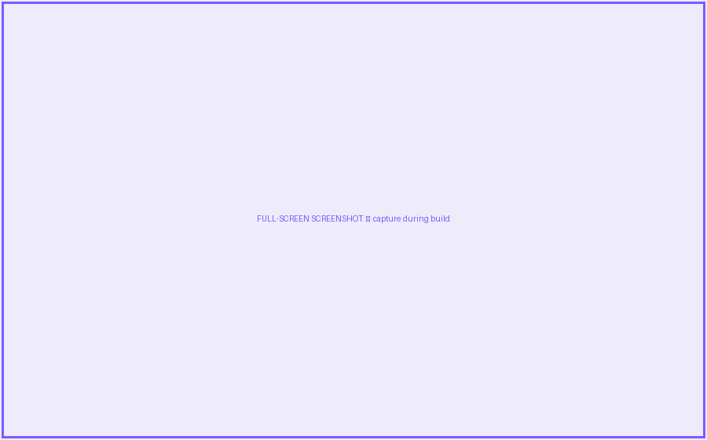
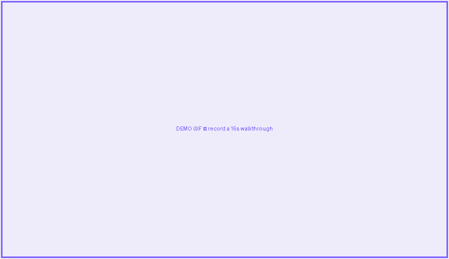

# Time-off & Team Absence

> Personal + managerial, 100% Graph — deploy in minutes.

     

## Summary

Ask how much leave you have and who's out next week. Personal balance plus a manager team view, powered entirely by Microsoft Graph — zero list setup required.

This is a **SharePoint Copilot App** built as an SPFx 1.24 **Copilot Component** (`TimeOff`). The same React component renders in two modes inside the Copilot canvas — a compact **inline** card and an immersive **full-screen** experience — and can also be surfaced as a classic web part.

## Concept mockup



*Inline (left) + full-screen (right). Replace with real screenshots once the component is built.*

## Screenshots & demo

> 🖼️ **Image placeholders** — replace the files in `./assets/` with real captures during the build.

| Inline | Full screen |
| --- | --- |
|  |  |



## Business value

Personal + managerial, 100% Graph — deploy in minutes. Target audience: **enterprise customers and ISV/SI builders**. Uses mocked data so anyone can deploy and demo in minutes — no LOB integration required.

## UX components

Leave-balance gauge · team absence calendar · request / approval form

## Data source

Microsoft Graph (`/me`, `/me/directReports`, `/me/calendarView`); balances from list **`LeaveBalances`**. Mock fallback in `/sampledata`.

> All data is **mocked** for the sample. A swappable data service exposes a `useMock` flag — `true` for offline demos, `false` to read the live SharePoint list / Microsoft Graph.

## Inline experience

**Leave-balance gauge** (e.g. 14 / 25 days) + 3 chips (Annual, Sick, Carryover) + a *Request time off* button.

## Full-screen experience

**Team absence month calendar** (rows = direct reports, out-days shaded) + balance-breakdown bars + a request/approval panel.

## Wireframe

```text
INLINE  ◔ 14 of 25 days left   | Annual 11 | Sick 3 | Carryover 2 |   (Request time off)

FULL    Month calendar: rows = team members, shaded = out   +   Balance bars   +   Request panel
```

## Build it with GitHub Copilot

Paste these prompts into **GitHub Copilot Chat** with the SPFx 1.24 Copilot Component scaffold open. Assumes React + TypeScript, Fluent UI v9, theme-aware (dark/light from the canvas), and a swappable data service.

### Inline prompt

```text
Build SPFx Copilot Component TimeOff, inline mode, React+TS+Fluent v9. Show the signed-in user's leave-balance as a radial gauge (used/total) plus chips for Annual/Sick/Carryover, and a 'Request time off' primary button opening a flyout (start, end, type, submit). Use GraphService (/me) for identity and a LeaveService over SharePoint list LeaveBalances with mock fallback. Theme-aware, accessible, responsive.
```

### Full-screen prompt

```text
Add full-screen mode to TimeOff for managers: a month-grid team absence calendar (rows = /me/directReports from Graph, cells shaded for out-days from /me/calendarView), a balance-breakdown bar chart, and a side request/approval panel. Color-code leave types; theme-aware; keyboard navigable; mock data fallback when Graph is unavailable.
```

## Run & deploy

```bash
# 1. Scaffold (choose the "Copilot Component" type)
yo @microsoft/sharepoint

# 2. Provision the mock data list(s) from /sampledata (PnP template)
#    — or keep useMock = true for a fully offline demo

# 3. Develop & preview in the Copilot Component Workbench
gulp serve

# 4. Package and deploy to the tenant App Catalog
gulp bundle --ship && gulp package-solution --ship
```

Then invoke the agent in Copilot and confirm the inline render, expand-to-full-screen, filtering and dark/light theming.

## Applies to

- [SharePoint Framework 1.24+](https://aka.ms/spfx) (Copilot Component)
- Microsoft 365 Copilot
- Microsoft 365 tenant with the SharePoint App Catalog

## Prerequisites

- Node.js 18.x, gulp-cli, Yeoman + `@microsoft/generator-sharepoint`
- A Microsoft 365 tenant with SPFx 1.24 (public preview) enabled

## Folder structure

```text
04-time-off-absence/
  README.md
  assets/
    concept-mockup.png          # provided concept visual
    screenshot-inline.png       # placeholder — replace
    screenshot-fullscreen.png   # placeholder — replace
    demo.gif                    # placeholder — replace
  src/                          # add your SPFx solution here
  sampledata/                   # mock JSON + PnP provisioning template
```

---

*Part of the **SharePoint Copilot Apps** sample gallery — complex UX in the Copilot canvas, powered by SPFx. See [aka.ms/spfx](https://aka.ms/spfx).*
