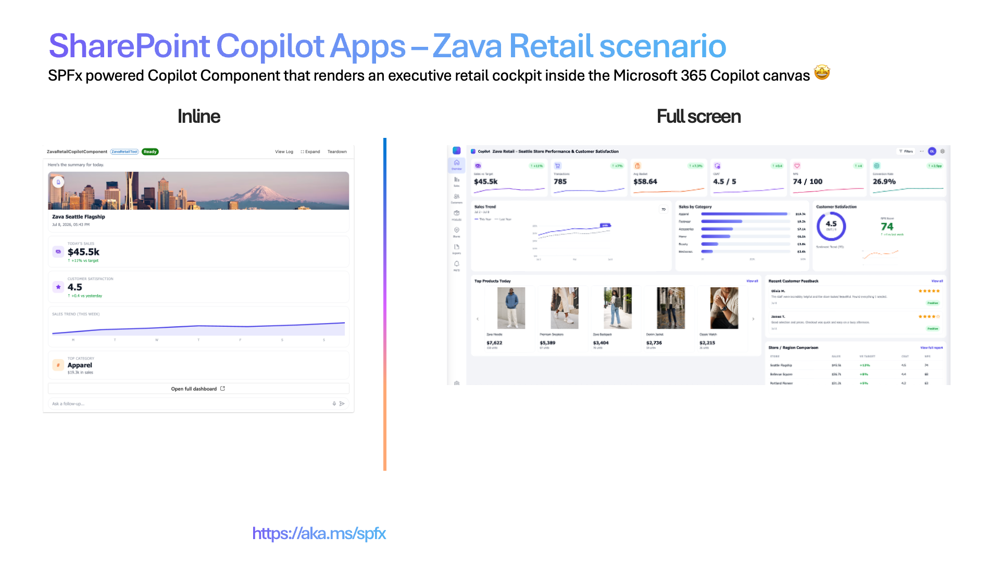
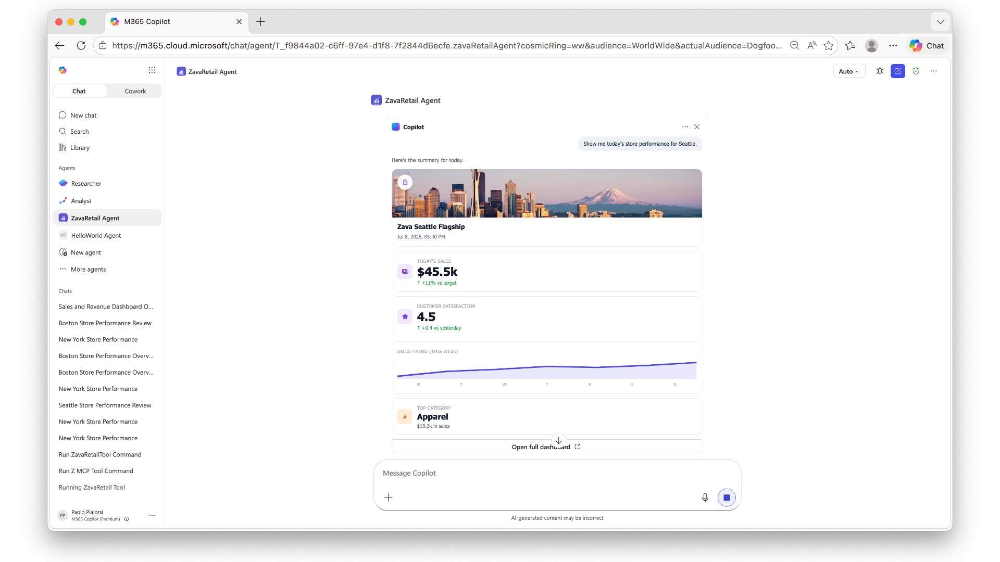
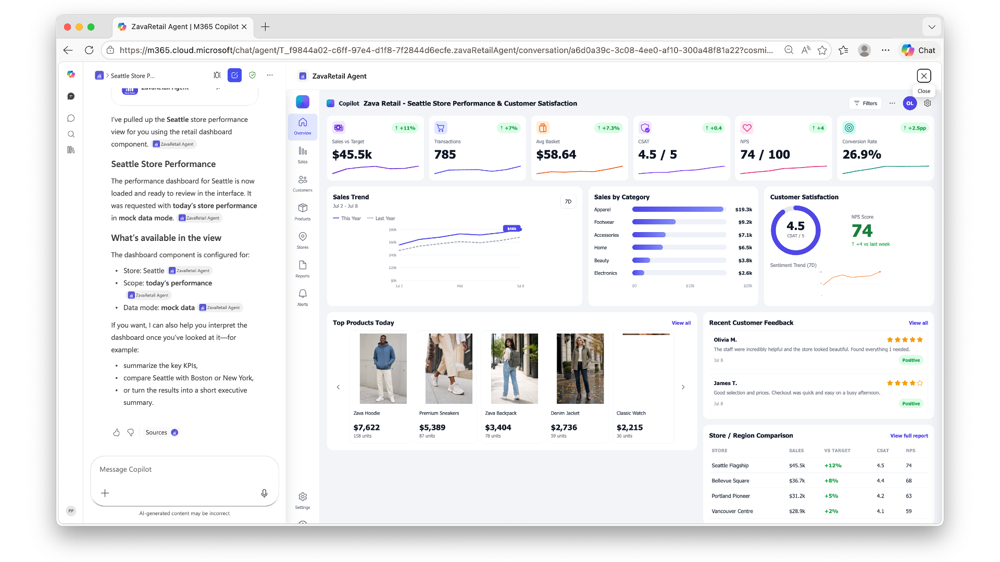

# Zava Retail Store — Retail Performance Copilot App

> An executive retail cockpit that lives inside the Microsoft 365 Copilot canvas — store performance and customer satisfaction at a glance.

     

## Summary

**Zava Retail Store** is a **SharePoint Copilot App** built as an SPFx 1.24 **Copilot Component** (not a classic web part). Copilot opens to a compact performance card — key metrics and a sales trend — then expands to a full executive dashboard covering sales, category mix, customer satisfaction, feedback, top products and store comparisons. Maximum impact for a retail launch demo.

The same React component renders in two modes inside the Copilot canvas:

- a compact **inline** card, and
- an immersive **full-screen** executive dashboard.

The sample ships with **mocked data** so anyone can deploy and demo in minutes — no line-of-business integration required. A swappable data service exposes a `useMock` flag (`true` for offline demos, `false` to read a live data service and Microsoft Graph for the signed-in user).



_Inline (left) + full-screen (right)._

## Screenshots & demo

| Inline | Full screen |
| --- | --- |
|  |  |


## Used SharePoint Framework Version


## Applies to

- [SharePoint Framework](https://aka.ms/spfx) 1.24+ (Copilot Component)
- [Microsoft 365 Copilot](https://www.microsoft.com/microsoft-365/copilot)
- [Microsoft 365 tenant](https://docs.microsoft.com/sharepoint/dev/spfx/set-up-your-developer-tenant) with the SharePoint App Catalog

> Get your own free development tenant by subscribing to the [Microsoft 365 developer program](http://aka.ms/o365devprogram)

## Prerequisites

- Node.js >=22.14.0 <23.0.0
- A Microsoft 365 tenant with SPFx 1.24 (dev preview) enabled
- SharePoint App Catalog site
- [Heft](https://heft.rushstack.io/) (`npm install -g @rushstack/heft`)
- Yeoman + `@microsoft/generator-sharepoint` (only needed to scaffold additional components)

> This solution uses the **Heft** build system (not Gulp), **React 17** functional components and **Fluent UI v9**, aligned with the SPFx 1.24 dev preview.

## Solution

| Solution          | Author(s)                                               |
| ----------------- | ------------------------------------------------------- |
| zava-retail-store | Author details (name, company, twitter alias with link) |

## Version history

| Version | Date | Comments        |
| ------- | ---- | --------------- |
| 1.0     | TBD  | Initial release |

## Disclaimer

**THIS CODE IS PROVIDED _AS IS_ WITHOUT WARRANTY OF ANY KIND, EITHER EXPRESS OR IMPLIED, INCLUDING ANY IMPLIED WARRANTIES OF FITNESS FOR A PARTICULAR PURPOSE, MERCHANTABILITY, OR NON-INFRINGEMENT.**

---

## Minimal Path to Awesome

- Clone this repository
- Ensure that you are at the solution folder (`zava-retail-store`)
- In the command-line run:
  - `npm install -g @rushstack/heft`
  - `npm install`
  - `heft start --clean` — local dev server at `https://localhost:4321`
- Invoke the agent in Copilot and confirm the inline render, expand-to-full-screen, and dark/light theming.

Production build, test, and package:

```bash
heft test --clean --production && heft package-solution --production
```

Other build commands can be listed using `heft --help`.

## Features

Zava Retail Store demonstrates how to build a rich, theme-aware executive dashboard inside the Microsoft 365 Copilot canvas using an SPFx Copilot Component.

This sample illustrates the following concepts:

- **Copilot Component UX** — a `CopilotComponent` (`copilotType: "Ux"`) surfaced as a tool (`ZavaRetailTool`) a declarative agent can call, rendering its own React UI inside the Copilot host.
- **Display-mode-aware rendering** — a single root React component (`ZavaRetailApp`) selects a dedicated **inline** or **full-screen** view from the host-advertised display mode; inline can request expansion to full screen.
- **Swappable data service** — Microsoft Graph + data service access behind a `useMock` flag, with mock data fallback for fully offline demos.
- **Theme awareness** — light/dark theme driven by the Copilot host context and Fluent UI v9 (`webLightTheme` / `webDarkTheme`).

### UX components

Metrics row · sales trend line chart · sales-by-category · satisfaction gauge · customer feedback · product carousel · store comparison · sparklines

### Inline experience

Compact performance card — headline metrics plus a sales trend at-a-glance summary, with a control to expand into the full dashboard.

### Full-screen experience

Executive dashboard shell (app rail + top bar) composed of modular sections: metrics row, sales trend panel, sales by category, customer satisfaction, customer feedback, top-products carousel and store comparison — plus a settings dialog for data source and theme.

### Wireframe

```text
INLINE  🏬 Zava Retail — Seattle   ▲ Sales $128.4k   ◔ CSAT 4.6   ▸ Expand dashboard

FULL    ┌ Metrics row ───────────────┐
        ├ Sales trend ┤├ Categories ┤├ Satisfaction ◔ ┤
        ├ Feedback ───┤├ Top products carousel ┤├ Store comparison ┤
```

## Data source

Microsoft Graph (`/me`, `/me/photo` for the signed-in user); retail metrics, categories, feedback and product catalog from a data service. All data is **mocked** for the sample via a swappable data service (`useMock` flag); set `useMock` to `"false"` and provide a `dataServiceUrl` to read live data.

## Solution structure

```text
zava-retail-store/
  README.md
  config/                       # Heft / SPFx + Copilot agent configuration
  copilot/                      # declarative agent + plugin manifests
  src/
    copilotComponents/
      zavaRetail/
        ZavaRetailCopilotComponent.ts             # entry point (mounts React)
        ZavaRetailCopilotComponent.manifest.json  # component + tools manifest
        ZavaRetailCopilotComponentProperties.ts   # Zod tool-input schema
        ZavaRetailApp.tsx                         # root selector (inline vs. full-screen)
        propertyParsers.ts                        # string-encoded property parsing
        components/
          InlineView.tsx        # inline display-mode view
          FullScreenView.tsx    # full-screen dashboard shell
          MetricsRow.tsx · SalesTrendPanel.tsx · SalesByCategory.tsx
          SatisfactionPanel.tsx · CustomerFeedback.tsx · ProductCarousel.tsx
          StoreComparison.tsx · Gauge.tsx · LineChart.tsx · Sparkline.tsx
        data/
          ZavaRetailDataService.ts                # swappable mock / live data service
        assets/products/                          # product images
```

## References

- [Getting started with SharePoint Framework](https://docs.microsoft.com/sharepoint/dev/spfx/set-up-your-developer-tenant)
- [Use Microsoft Graph in your solution](https://docs.microsoft.com/sharepoint/dev/spfx/web-parts/get-started/using-microsoft-graph-apis)
- [Heft Documentation](https://heft.rushstack.io/)
- [Fluent UI React v9](https://react.fluentui.dev/)
- [PnP React controls](https://pnp.github.io/sp-dev-fx-controls-react/)
- [Microsoft 365 & Power Platform Community](https://aka.ms/community/home) - Guidance, tooling, samples and open-source controls for your Copilot, Microsoft 365 & Power Platform development

---

> Notice that better pictures and documentation will increase the sample usage and the value you are providing for others. Thanks for your submissions in advance.

> Share your solution with others through the Microsoft 365 Patterns and Practices program to get visibility and exposure. More details on the community, open-source projects and other activities from http://aka.ms/community/home.

_Part of the **SharePoint Copilot Apps** sample gallery — complex UX in the Copilot canvas, powered by SPFx. See [aka.ms/spfx](https://aka.ms/spfx)._